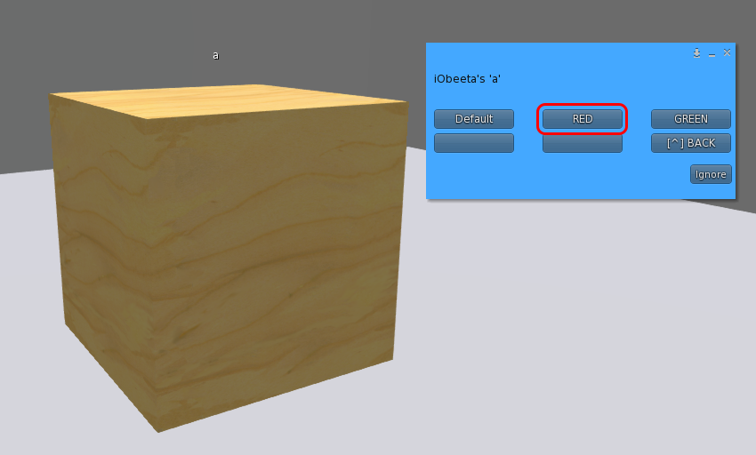
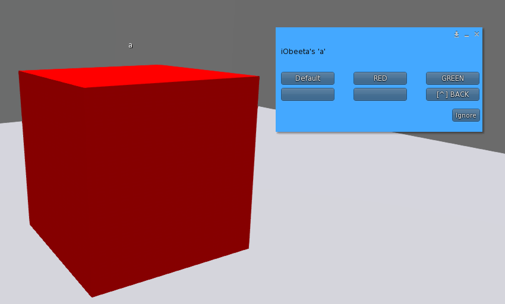

# Smart Texture Changer

## 配置信息

### 日志输出级别

- 取值: 0(静默), 15(info), 31(debug), 63(trace/全部)
- 默认: 0

```lsl
LOG_LEVEL 0
```

### 部件菜单提示文字

- 默认: 空字符串

```lsl
MENU_TEXT_PARTS PART
```

### 贴图方案菜单提示文字

- 默认: 空字符串

```lsl
MENU_TEXT_SETS SET
```

### 是否可以通过点击弹出菜单

- 取值: 0(否), 1(是)
- 默认: 1

```lsl
TOUCH 1
```

### 点击行为属性

当本脚本在子prim中, 有点击弹出菜单行为时会用到

- 取值: 0, 1, 2
- 默认: 0
- 详见 [https://wiki.secondlife.com/wiki/LlPassTouches](https://wiki.secondlife.com/wiki/LlPassTouches)

```lsl
PASS_TOUCHS 0
```

### 只有所有者可以点击

- 取值: 0(否), 1(是)
- 默认: 1

```lsl
OWNER_ONLY 1
```

### 本地频道唤起弹出菜单

不为"0"时生效

- 取值: −2147483648 ~ +2147483647
- 默认: 0

```lsl
CHANNEL_LOCAL_MENU 0
```

### 本地频道返回上一级菜单

上一级菜单需要通过本地消息监听本频道，不为"0"时生效

- 当本项目配置之后，它将作为 PART 菜单的选项显示在菜单中，显示为 "[^] BACK"
- 取值: −2147483648 ~ +2147483647
- 默认: 0

```lsl
CHANNEL_LOCAL_MENU_BACK 0
```

### 本地接收以应用套装

用于接收 CHANNEL_LOCAL_BOARDCAST 的广播数据，不为"0"时生效

- 注意！无论本体或多层使用，CHANNEL_LOCAL_SYNC 与 CHANNEL_LOCAL_BOARDCAST 不可形成闭环！切记！
- 取值: −2147483648 ~ +2147483647
- 默认: 0

```lsl
CHANNEL_LOCAL_SYNC 0
```

### 本地频道广播套装

会被同值的CHANNEL_LOCAL_SYNC接收，不为"0"时生效

- 注意！无论本体或多层使用，CHANNEL_LOCAL_SYNC 与 CHANNEL_LOCAL_BOARDCAST 不可形成闭环！切记！
- 取值: −2147483648 ~ +2147483647
- 默认: 0

```lsl
CHANNEL_LOCAL_BOARDCAST 0
```

### 套装选项名称

用于批量生效多个部件的某一种贴图方案。

- 当本项目配置之后，它将作为 PART 菜单的选项显示在菜单中，并会自动生成或根据SETS关键词构建套装列表。
- 留空则此选项无效
- 默认：空字符串

```lsl
MENU_OPTION_SETS [set name]
```

### 自定义的套装列表

- 以MENU_OPTION_SETS为入口，进入后显示此列表
- 如果未设置或为空字符串，将会自动生成列表，包括所有 PART 中的全部 SET 关键字。
- 默认：空字符串

```lsl
SETS RED|GREEN
```

### 部件

同一个linkset中可以有多个同名物体，他们都会被匹配并替换

- 第三个参数 face 可以使用常量 ALL_SIDES

```lsl
PART OBJ_1|object name 1|ALL_SIDES
```

### 贴图方案

PART部件的子选项

- 可使用SL常量包括 TEXTURE_BLANK, TEXTURE_DEFAULT, TEXTURE_TRANSPARENT, TEXTURE_PLYWOOD, NULL_KEY。当然您也可以直接使用他们对应的UUID
- 详见：[https://wiki.secondlife.com/wiki/Category:LSL_Constants](https://wiki.secondlife.com/wiki/Category:LSL_Constants)
- *如果某个贴图的UUID留空，它将会被忽略（保持之前的贴图不变），如果想覆盖失效某个贴图，请使用 NULL_KEY。
- *贴图方案SET必须跟随在某一个部件PART之后，它们作为PART的下一级菜单展示。

```lsl
SET RED|TEXTURE_BLANK|NULL_KEY|NULL_KEY
SET GREEN|TEXTURE_BLANK||
```

### PART*

与 PART 都表示一个部件，不同的是PART*并不会显示在部件菜单中。套装对此部件有效。

```lsl
PART* OBJ_2|object name 2|ALL_SIDES
SET RED|TEXTURE_BLANK|NULL_KEY|NULL_KEY
SET GREEN|TEXTURE_BLANK|NULL_KEY|NULL_KEY
```

### 自定义菜单

- 与 PART 显示在同一级菜单中，点击可发送本地消息。
- 第三个参数可以"|"分隔

```lsl
BUTTON MORE|100|arguments
```

## 示例

### 简单的例子

```lsl
PART A|a|ALL_SIDES
SET Default|TEXTURE_PLYWOOD||
SET RED|9c198f45-3f70-1a50-f38c-8ce19044b396||
SET GREEN|2f8ae0e4-22be-20c8-c0cc-c50bbfaf2871||
```

|||
|---|---|
|  |  |
| 1. 单物件名为"a" | 2. 点击物件弹出菜单 |
|  |  |
| 3. 选择"A" | 4. 选择"RED" |
