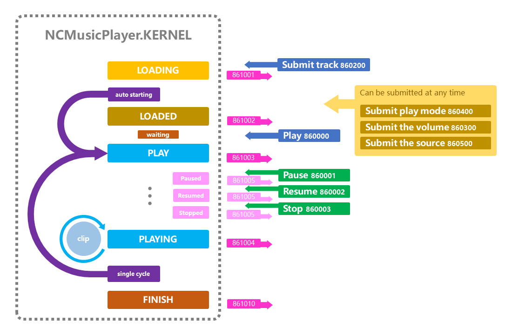

# NCMusicPlayer.KERNEL

Notecard based music player

## Include scripts

- NCMusicPlayer.KERNEL (kernel *required)
- NCMusicPlayer.PreLoader (asynchronous loader *required)

## Music

- One track corresponds to one notecard, and the name of the notecard is the name of the track.
- Write the uuids in notecard, one clip of uuid per line.
- Each clip has a default duration of **10.0** seconds.
  - If the clip duration is not **NOT 10.0** seconds, write the clip duration on the first line.
  - If the clip durations are not equal, please add ```|duration``` after the uuid.
  - The duration of the first line can coexist with the duration specified for each line, and the duration of a single row has a higher priority.
  - No need to specify when the last segment is less than **10.0** seconds.

Example:

**Clip duration is standard 10.0 seconds**

```text
767225e4-ff93-9c73-ae97-21da47ab1077
0b194a9d-8225-fd46-23c6-4c46e73dbbbd
```

**Clip duration is the standard uniform 9.86 seconds**

```text
9.86
767225e4-ff93-9c73-ae97-21da47ab1077
0b194a9d-8225-fd46-23c6-4c46e73dbbbd
```

**Clip durations are mostly 9.62 seconds, but there are special ones**

```text
9.62
767225e4-ff93-9c73-ae97-21da47ab1077|3.45
0b194a9d-8225-fd46-23c6-4c46e73dbbbd
```

## Link Message



### Link Message to Send

**860000 PLAY**

To start playing a loaded track, the track must first be submitted at 860400. If no tracks are submitted, this directive will have no effect.

```lsl
llMessageLinked(LINK_SET, 860000, "","");
```

**860001 Pause**

(not implemented)

**860002 Resume**

(not implemented)

**860003 Stop**

Stop the track that is playing.

```lsl
llMessageLinked(LINK_SET, 860003, "","");
```

**860200 Submit track**

Submit the track name (notecard name) to be played.

```lsl
llMessageLinked(LINK_SET, 860200, "Notecard name", "");
```

If you give the fourth parameter and assign the value ```1``` when submitting, it will automatically start playing after loading is complete.

*Here it is optimized! If it is set to start playing automatically, it will start playing before all the sound clips are loaded. It doesn't take long to wait due to too many clips.*

```lsl
llMessageLinked(LINK_SET, 860200, "Notecard name", "1");

// similar to
llMessageLinked(LINK_SET, 860200, "Notecard name", "");
llSleep(1.0); // Notice! An estimated load time must be added here.
llMessageLinked(LINK_SET, 860000, "","");

// fully equivalent form
default
{
    touch_start(integer num_detected) {
        llMessageLinked(LINK_SET, 860200, "Notecard name", "");
    }

    link_message(integer sender, integer num, string str, key id) {
        if(num == 861002) {
            llMessageLinked(LINK_SET, 860000, "","");
        }
    }
}
```

**860300 Submit the volume**

Volume value range 0.0 ~ 1.0

```lsl
llMessageLinked(LINK_SET, 860300, "Notecard name", "1");
```

**860400 Submit play mode**

Single cycle, value. 0: off (default), 1: on

**860500 Submit source**

Support ```llLinkPlaySound```

Set which prim to play, value: ```LINK_THIS```(default), ```LINK_SET```, ```LINK_ROOT```, ```LINK_ALL_OTHERS```, ```LINK_ALL_CHILDREN```.

### Link Message to Receive

Broadcast to ```LINK_SET```

**861001 Loading**

```lsl
default
{
    link_message(integer sender, integer num, string str, key id) {
        if(num == 861001) {
            string TRACK_NAME = str;
        }
    }
}
```

**861002 Loaded**

```lsl
default
{
    link_message(integer sender, integer num, string str, key id) {
        if(num == 861002) {
            list data = llParseString2List(str, ["|"], []);

            // Track(notecard) name
            string TRACK_NAME = llList2String(data, 0);

            // Number of clip of music
            integer TOTAL_CLIPS = (integer)llList2String(data, 1);
        }
    }
}
```

**861003 Played**

```lsl
default
{
    link_message(integer sender, integer num, string str, key id) {
        if(num == 861003) {
            list data = llParseString2List(str, ["|"], []);

            // Track(notecard) name
            string TRACK_NAME = llList2String(data, 0);

            // Music clip index
            integer CLIP_INDEX = (integer)llList2String(data, 1);
        }
    }
}
```

**861004 Playing**

Triggered when switching clips

```lsl
default
{
    link_message(integer sender, integer num, string str, key id) {
        if(num == 861004) {
            list data = llParseString2List(str, ["|"], []);

            // Track(notecard) name
            string TRACK_NAME = llList2String(data, 0);

            // Music clip index
            integer CLIP_INDEX = (integer)llList2String(data, 1);

            // Clip duration
            float CLIP_DURATION = (float)llList2String(data, 2);

            // Clip start time (Relative to the start of this track)
            float CLIP_START_TIME = (float)llList2String(data, 3);

            // Clip end time (Relative to the start of this track)
            float CLIP_END_TIME = (float)llList2String(data, 4);
        }
    }
}
```

**861005 Stopped**

```lsl
default
{
    link_message(integer sender, integer num, string str, key id) {
        if(num == 861005) {
            list data = llParseString2List(str, ["|"], []);

            // Track(notecard) name
            string TRACK_NAME = llList2String(data, 0);

            // Music clip index
            integer CLIP_INDEX = (integer)llList2String(data, 1);
        }
    }
}
```

**861006 Paused**

```lsl
default
{
    link_message(integer sender, integer num, string str, key id) {
        if(num == 861006) {
            list data = llParseString2List(str, ["|"], []);

            // Track(notecard) name
            string TRACK_NAME = llList2String(data, 0);

            // Music clip index
            integer CLIP_INDEX = (integer)llList2String(data, 1);
        }
    }
}
```

**861007 Resumed**

```lsl
default
{
    link_message(integer sender, integer num, string str, key id) {
        if(num == 861007) {
            list data = llParseString2List(str, ["|"], []);

            // Track(notecard) name
            string TRACK_NAME = llList2String(data, 0);

            // Music clip index
            integer CLIP_INDEX = (integer)llList2String(data, 1);
        }
    }
}
```

**861010 Track Finished**

The playback of all the clips of the single track ends.

This message will never be received if the playback mode ```Single Loop``` is on.

```lsl
default
{
    link_message(integer sender, integer num, string str, key id) {
        if(num == 861010) {
            string TRACK_NAME = str;
        }
    }
}
```
