# OAC Devkit

Version: 4.4

[PDF Document](https://iobeeta.github.io/docs/OAC%20Devkit/OAC%20Devkit.pdf)

## Features

- Smooth transformation, easing vision.
- Flexible configuration and combination.
- During the transformation process, the direction can be changed at any time.

## Quick Start. Follow this, step by step

1. Prepare your object.
2. According to your needs, select the configuration file which starts with ".OAC", change their parameters and drag them into the inventory.
3. Drag the main script named ```OAC.KERNEL``` into the inventory.
4. Select the trigger script you need, drag and drop it into the object. Some trigger scripts have been preset for you in "Extra". Of course, you can customize them according to your needs.
5. Done.

### Make a single sliding door

|||
|:-:|:-:|
| 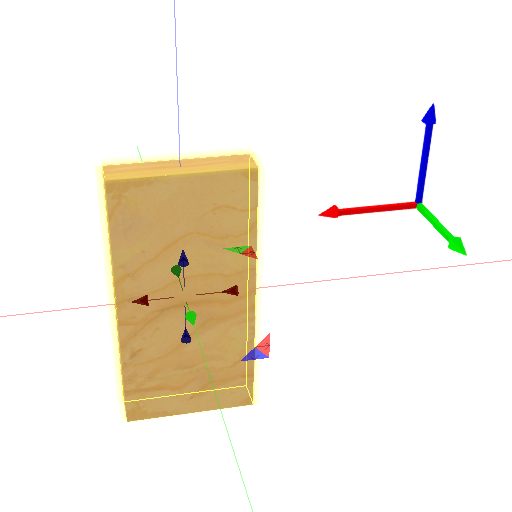 | 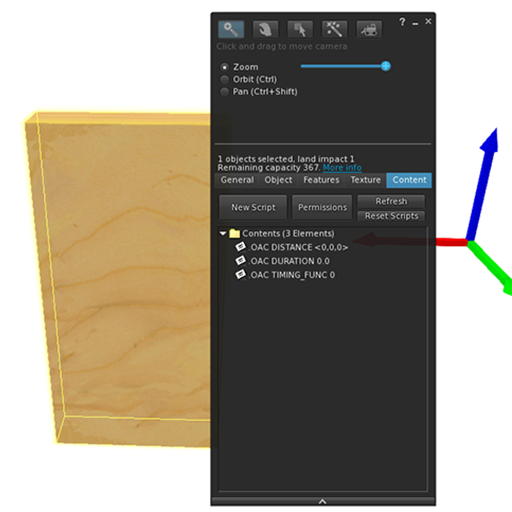 |
| Create a box, resized like a door | Select the function you need, drag and drop them to the inventory |
| 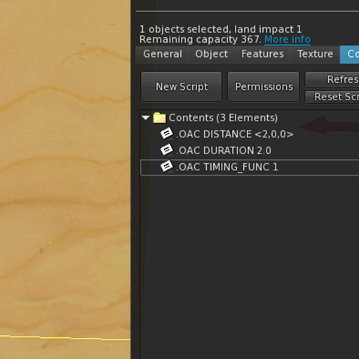 | 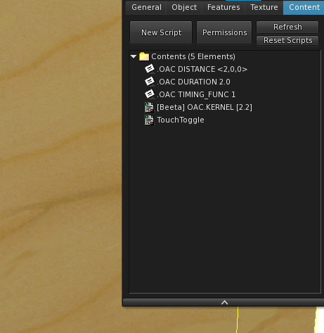 |
| Change parameters<br/>Move 2 meters in the X direction<br/>The duration 2 seconds<br/>Use the ease-in-out timing function | Drag and drop scripts |

**Touch to see the effect**

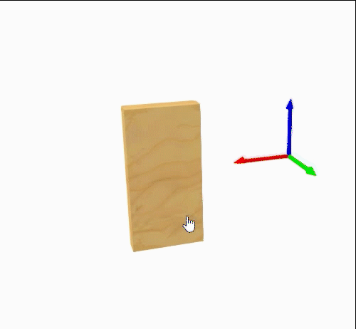

**For more detailed examples, please test and edit after rez them in "Example"**

## Scripts

| name | description |
|---|---|
| OAC.KERNEL | **(required)** Main script |

**Extra**

| name | description |
|---|---|
| TouchToggle | Make the prim touchable, touch to trigger toggle, it will only trigger the current prim(LINK_THIS). |
| TouchToggleSync | Make the prim touchable, touch to trigger toggle, it will trigger all prims in the linkset(LINK_SET). |
| AutoClose 30s | Automatically close after 30 seconds when it is opened. |
| AutoToggle after end 20s | When the transformation is end, wait for 20 seconds to switch the state, looping. |
| AgentSensorOpen | Open when someone is nearby. |
| AgentSensorToggle | Open when someone is nearby, close when no one is around. |
| SoundTrigger | Play sound during operation. This script is preset as an electric door, which can be changed arbitrarily. |

## Configuration

One notecard represents one configuration field, drag notecard to inventory, edit its name.

Format: .OAC {key} {value}

| key | type | value | default | description | version |
|---|---|---|---|---|---|
| BROADCAST2 | integer | > -5 && != 0 | -4 | Broadcast sending range, -4:`LINK_THIS`, -3:`LINK_ALL_CHILDREN`, -2:`LINK_ALL_OTHERS`, -1:`LINK_SET`, 1:`LINK_ROOT`, and others | 3.3 |
| DURATION | float | Any | 0.0 | If less than 0.1, it is treated as 0.0,<br/>0.0 means no transformation process | 1.7 |
| DISTANCE | vector | Any | <0.0,0.0,0.0> | Transform distance | 4.0 |
| ROTATION | vector | Any | <0.0,0.0,0.0> | Transform rotation, The meaning of this vector is <ROLL, PITCH, YAW>. <br/>* The rotation is always relative to the prim's local directional vector. | 1.8 |
| SCALE | vector | Greater than <0.0,0.0,0.0> | <1.0,1.0,1.0> | Scale, scale change, no negative value, if equal to ZERO_VECTOR (<0.0,0.0,0.0>), it is considered invalid | 3.0 |
| ORIGIN | integer | 0/1/2 | 0 | see special note below | 2.0 |
| EASING | string | | | see special note below | 4.4 |
| Q | string | | | Queue mode, see below | 3.0 |

### DISTANCE special usage

After version 4.0, the value of DISTANCE adds an option relative to the object size, supporting the suffix x, y, z, X, Y, Z.

- x, y, z: the size of this prim
- X, Y, Z: size of root prim

```lsl
DISTANCE <1.2x,2X,0.5z> //Move 1.2 times the current prim size x in the x direction, 2 times the root prim size x in the y direction, and 0.5 times the current prim size z in the z direction.
```

**examples**

There is a sliding door with width x, height z, and thickness y. Opening the door requires moving 0.8 times the width of the door along the x-axis, as written below:

```lsl
DISTANCE <0.8x,0,0>
```

For a scalable slider, we cannot determine its size, so we cannot determine the specific distance it moves. We only know that it will rise along the z-axis by a height 2 times the root prim size y. It is written as follows:

```lsl
DISTANCE <0,0,2Y>
```

### ORIGIN

#### local (0)

The transformation will refer to the local directional vector.

Example:

```text
.OAC DISTANCE <1.0, 0.0, 0.0>
.OAC ORIGIN 0
```

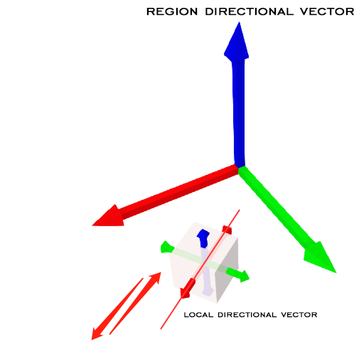

#### root (1)

The transformation will refer to the root prim directional vector.

Example:

```text
.OAC DISTANCE <1.0, 0.0, 0.0>
.OAC ORIGIN 1
```

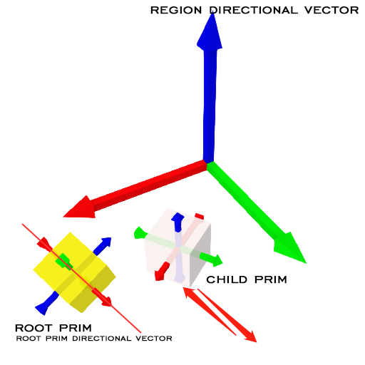

It only works for child prims in linkset. When the object is the root prim or it is a standalone prim, **root=region**

#### region (2)

The transformation will refer to the region directional vector.

Example:

```text
.OAC DISTANCE <1.0, 0.0, 0.0>
.OAC ORIGIN 2
```

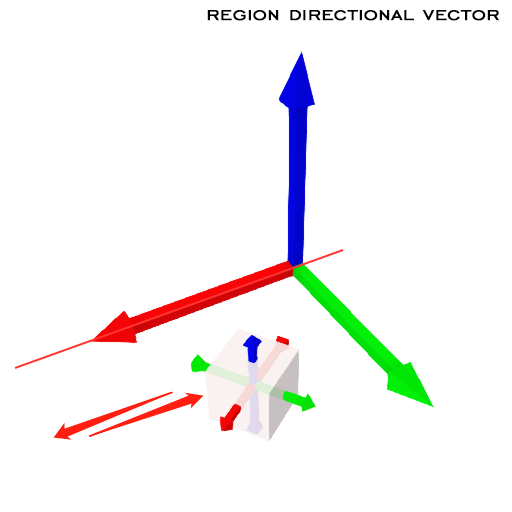

### EASING

```.OAC EASING {Name/Abbreviation/Number}```

```lsl
.OAC EASING easeOutSine
// OR
.OAC EASING OSI
// OR
.OAC EASING 01
```

Define easing for forward and reverse transformations separately

```.OAC EASING {OPEN/Forward},{CLOSE/Reverse}```

```lsl
.OAC EASING easeOutQuart,easeInQuart
// OR
.OAC EASING OQA,IQA
// OR
.OAC EASING 31,30
```

| ease-in | ease-out | ease-in-out |
|:-:|:-:|:-:|
| 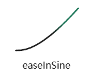 | 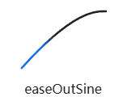 | 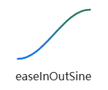 |
| easeInSine<br/>ISI<br/>00 | easeOutSine<br/>OSI<br/>01 | easeInOutSine<br/>IOSI<br/>02 |
| 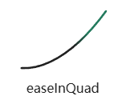 | 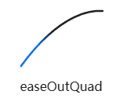 | 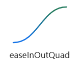 |
| easeInQuad<br/>IQD<br/>10 | easeOutQuad<br/>OQD<br/>11 | easeInOutQuad<br/>IOQD<br/>12 |
| 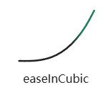 | 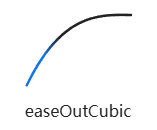 | 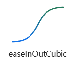 |
| easeInCubic<br/>ICU<br/>20 | easeOutCubic<br/>OCU<br/>21 | easeInOutCubic<br/>IOCU<br/>22 |
| 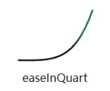 | 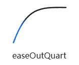 | 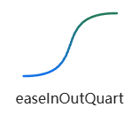 |
| easeInQuart<br/>IQA<br/>30 | easeOutQuart<br/>OQA<br/>31 | easeInOutQuart<br/>IOQA<br/>32 |
| 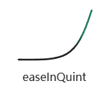 | 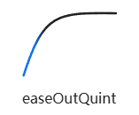 | 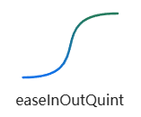 |
| easeInQuint<br/>IQI<br/>40 | easeOutQuint<br/>OQI<br/>41 | easeInOutQuint<br/>IOQI<br/>42 |
| 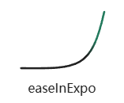 | 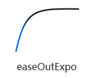 | 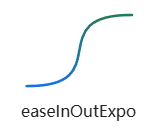 |
| easeInExpo<br/>IEX<br/>50 | easeOutExpo<br/>OEX<br/>51 | easeInOutExpo<br/>IOEX<br/>52 |
| 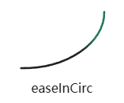 | 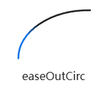 | 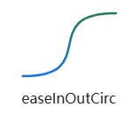 |
| easeInCirc<br/>ICI<br/>60 | easeOutCirc<br/>OCI<br/>61 | easeInOutCirc<br/>IOCI<br/>62 |
| 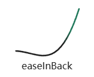 | 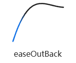 | 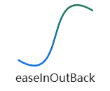 |
| easeInBack<br/>IBA<br/>70 | easeOutBack<br/>OBA<br/>71 | easeInOutBack<br/>IOBA<br/>72 |
| 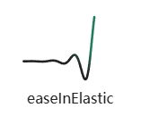 | 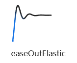 | 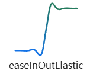 |
| easeInElastic<br/>IEL<br/>80 | easeOutElastic<br/>OEL<br/>81 | easeInOutElastic<br/>IOEL<br/>82 |
| 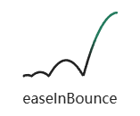 | 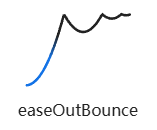 | 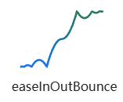 |
| easeInBounce<br/>IBO<br/>90 | easeOutBounce<br/>OBO<br/>91 | easeInOutBounce<br/>IOBO<br/>92 |

### Queue Mode

The Queue mode is added in version 3.0, which can continuously perform multiple change processes (forward and reverse), and continues the feature of switching directions at any point in time.

```text
.OAC Q {Number}/{DURATION}/{ORIGIN}/{EASING}/{DISTANCE}/{ROTATION}/{SCALE}
```

Yes, it writes the previously supported parameters in one line and assigns them to QUEUE, and then you can add multiple QUEUEs.

{Number} represents the order of QUEUE. In the content of PRIM, files are arranged in ascending order of file names, so as long as the sequence is correct, the number can be specified freely, whether it is 1234... or ABCD....

If you need to wait between two QUEUEs, you can join a QUEUE with only a duration, like this:

```text
.OAC Q 1/5.0///<10.0,0.0,0.0>//
.OAC Q 2/2.0/////
.OAC Q 3/5.0///<0.0,10.0,0.0>//
```

## Linkset message

### Link Message to Send

Num: **802840**

#### Open

positive movement

```lsl
llMessageLinked(..., 802840, "OPEN", "");
```

#### Close

reverse movement

```lsl
llMessageLinked(..., 802840, "CLOSE", "");
```

#### Toggle

Switch the current direction of movement

```lsl
llMessageLinked(..., 802840, "TOGGLE", "");
```

#### Set Direction

Manually submit and change the current running direction status

value:
Greater than 0: Set to opened (to be closed) state, and can be closed at this time (reverse transformation)
Less than or equal to 0: Set to closed (to be opened) state, and can be opened at this time (forward transformation)

```lsl
llMessageLinked(..., 802840, "DIRECTION|1", "");
llMessageLinked(..., 802840, "DIRECTION|-1", "");
```

#### Reset/Reload

Manual reset script. (Reload all parameter from Notecard)
Alias ​​reload

```lsl
llMessageLinked(..., 802840, "RELOAD", "");
// same
llMessageLinked(..., 802840, "RESET", "");
```

#### Submit global scale

Acting on DISTANCE, the moving distance magnification of the sub-PRIM in the zoomed state.

Default: 1.0，If the given value <0, the default value is used.

```lsl
llMessageLinked(..., 802840, "SCALE|1.0", "");
```

### Link Message to Receive

Num: **802841**

#### Transform started

To: `BROADCAST2` specified, default is -4:`LINK_THIS`

```lsl
TRANSFORM_STARTED|{direction}
```

direction:

- 1: open, positive movement
- -1: close, reverse movement

#### Transform finished

To: `BROADCAST2` specified, default is -4:`LINK_THIS`

```lsl
TRANSFORM_FINISHED|{direction}
```

direction:

- 1: open, positive movement
- -1: close, reverse movement

#### Transform processing (Queue mode)

To: `BROADCAST2` specified, default is -4:`LINK_THIS`

```lsl
TRANSFORM_PROCESS|{direction}|{queue index}|{effective}
```

direction:

- 1: open, positive movement
- -1: close, reverse movement

effective:

- 0: if no change in DISTANCE, ROTATION, SCALE
- 1: If any of DISTANCE, ROTATION, SCALE changes

### LinksetData Trigger

OAC.KERNEL will listen for ```LINKSETDATA_UPDATE```

name: "link-" + {linkNumber} + "-oac-stat"

- Triggers **CLOSE** when value is an **even number** (**0 [2 4 6...]**)
- Triggers **OPEN** when value is an **odd number** (**1 [3 5 7...]**)

```lsl
llLinksetDataWrite("link-" + (string)(1) + "-oac-stat", "1"); // OPEN
llLinksetDataWrite("link-" + (string)(1) + "-oac-stat", "0"); // CLOSE

llLinksetDataWrite("link-" + (string)(2) + "-oac-stat", "3"); // OPEN
llLinksetDataWrite("link-" + (string)(2) + "-oac-stat", "4"); // CLOSE
```
