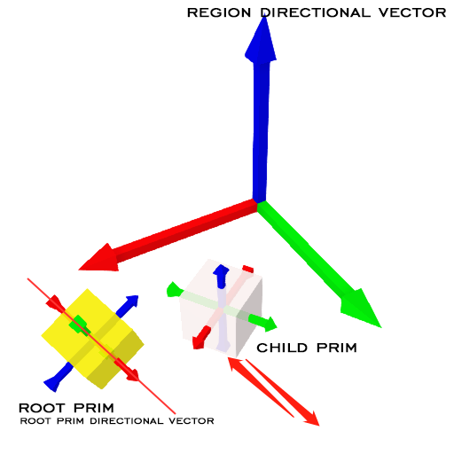

# OAC Devkit

Open And Close Development Kit

## Features

- Smooth transition
- Flexible configuration and combination
- During the transformation process, the direction can be changed at any time

## Configuration

One notecard represents one configuration field, drag notecard to inventory, edit its name.

Format: .OAC {key} {value}

| key | type | value | default | version | description |
|---|---|---|---|---|---|
| DURATION | float | Any | 0.0 | since 1.7 | If less than 0.1, it is treated as 0.0, 0.0 means no transformation process |
| DISTANCE | vector | Any | <0.0, 0.0, 0.0> | since 1.7 | Transform distance |
| ROTATION | vector | Any | <0.0, 0.0, 0.0> | since 1.8 | Transform rotation, The meaning of this vector is <ROLL, PITCH, YAW>. <br>* The rotation is always relative to the prim's local directional vector. |
| SCALE | float | more than 0.0 | 1.0 | since 2.1 | Transform scale, if less than or equal to 0.0, it is regarded as unchanged, equivalent to 1.0 |
| ORIGIN | integer | 0:local<br>1:root<br>2:region | 0 | since 2.0 | see special note below |
| TIMING_FUNC | integer | 0:linear<br>1:ease-in-out<br>2:ease-in<br>3:ease-out | 0 | since 2.0 | see special note below |

### About ORIGIN

#### 0: local

The transformation will refer to the local directional vector.

Example:

```
.OAC DISTANCE <1.0, 0.0, 0.0>
.OAC ORIGIN 0
```


#### 1: root

The transformation will refer to the root prim directional vector.

Example:

```
.OAC DISTANCE <1.0, 0.0, 0.0>
.OAC ORIGIN 1
```



It only works for child prims in linkset. When the object is the root prim or it is a standalone prim, **root=region**

#### 2: region

The transformation will refer to the region directional vector.

Example:

```
.OAC DISTANCE <1.0, 0.0, 0.0>
.OAC ORIGIN 2
```


### About TIMING_FUNC


## Linkset message

### Control or Submit

Num: **802840**

#### Open

positive movement

```lsl
llMessageLinked(LINK_SET, 802840, "OPEN", "");
```

#### Close

reverse movement

```lsl
llMessageLinked(LINK_SET, 802840, "CLOSE", "");
```

#### Toggle

Switch the current direction of movement

```lsl
llMessageLinked(LINK_SET, 802840, "TOGGLE", "");
```

### Event broadcast

Num: **802841**

#### Transform started

To: `LINK_SET`

```lsl
TRANSFORM_STARTED|{direction}
```

direction:

- 1: open, positive movement
- -1: close, reverse movement

#### Transform finished

To: `LINK_SET`

```lsl
TRANSFORM_FINISHED|{direction}
```

direction:

- 1: open, positive movement
- -1: close, reverse movement
