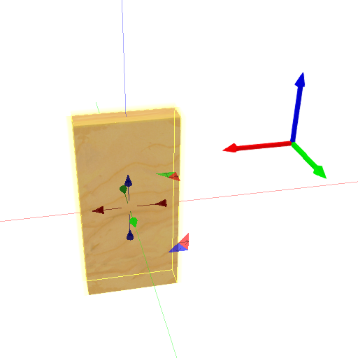
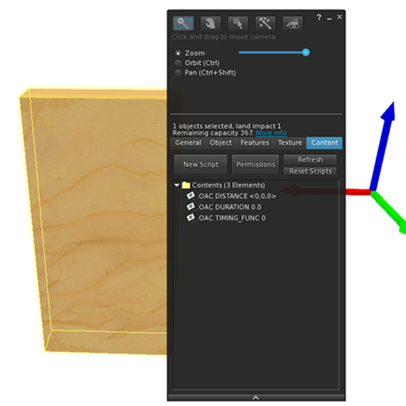
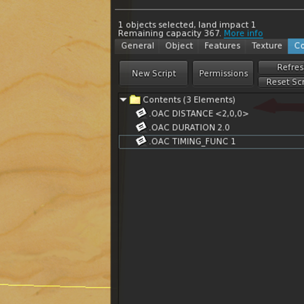
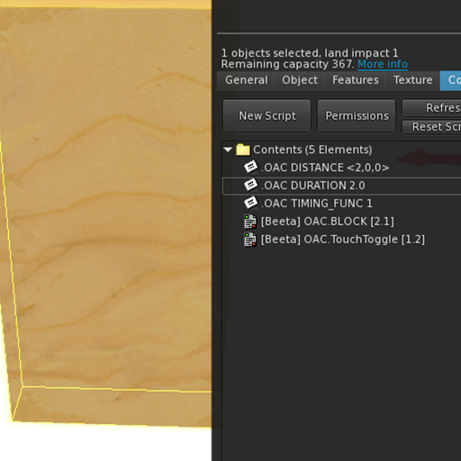
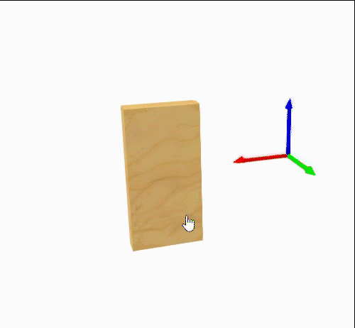
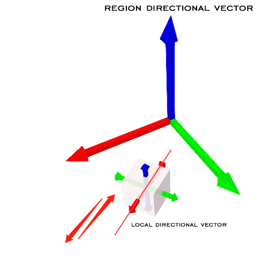
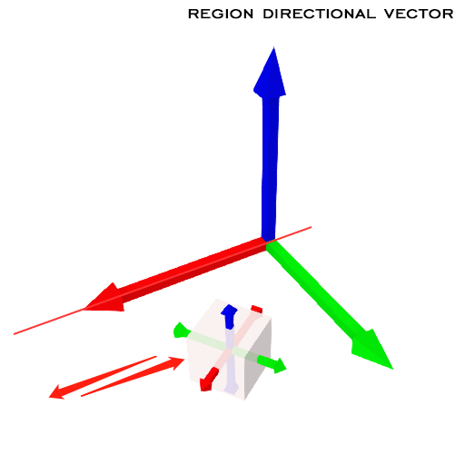
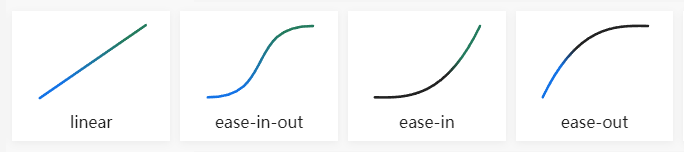

# Open And Close (OAC Devkit)

Open And Close Development Kit

Version: 2.1

## Features

- Smooth transformation, easing vision.
- Flexible configuration and combination.
- During the transformation process, the direction can be changed at any time.

## Quick Start. Follow this, step by step

1. Prepare your object.
2. According to your needs, select the configuration file which starts with ".OAC", change their parameters and drag them into the inventory.
3. Drag the main script named OAC.BLOCK into the inventory.
4. At present, we have provided you with two scripts for triggering, and you can develop scripts according to your own needs according to the following documents.
5. Touch to toggle.

### Make a single sliding door

|||
|:-:|:-:|
|  |  |
| Create a box, resized like a door | Select the function you need, drag and drop them to the inventory |
|  |  |
| Change parameters<br/>Move 2 meters in the X direction<br/>The duration 2 seconds<br/>Use the ease-in-out timing function | Drag and drop scripts |

**Touch to see the effect**



**For more detailed examples, please test and edit after rez them in "Example"**
## Scripts

| name | description |
|---|---|
| OAC.BLOCK | **(required)** Main script |
| OAC.TouchToggle | Make the prim touchable, touch to trigger toggle, it will only trigger the current prim(LINK_THIS). |
| OAC.TouchToggleSync | Make the prim touchable, touch to trigger toggle, it will trigger all prims in the linkset(LINK_SET). |

## Configuration

One notecard represents one configuration field, drag notecard to inventory, edit its name.

Format: .OAC {key} {value}

| key | type | value | default | description | version |
|---|---|---|---|---|---|
| DURATION | float | Any | 0.0 | If less than 0.1, it is treated as 0.0,<br/>0.0 means no transformation process | 1.7 |
| DISTANCE | vector | Any | <0.0,0.0,0.0> | Transform distance | 1.7 |
| ROTATION | vector | Any | <0.0,0.0,0.0> | Transform rotation, The meaning of this vector is <ROLL, PITCH, YAW>. <br/>* The rotation is always relative to the prim's local directional vector. | 1.8 |
| SCALE | float | > 0.0 | 1.0 | Transform scale, if less than or equal to 0.0, it is regarded as unchanged, equivalent to 1.0 | 2.1 |
| ORIGIN | integer | 0:local<br/>1:root<br/>2:region | 0 | see special note below | 2.0 |
| TIMING_FUNC | integer | 0:linear<br/>1:ease-in-out<br/>2:ease-in<br/>3:ease-out | 0 | see special note below | 2.0 |

### About ORIGIN

#### 0: local

The transformation will refer to the local directional vector.

Example:

```
.OAC DISTANCE <1.0, 0.0, 0.0>
.OAC ORIGIN 0
```



#### 1: root

The transformation will refer to the root prim directional vector.

Example:

```
.OAC DISTANCE <1.0, 0.0, 0.0>
.OAC ORIGIN 1
```


It only works for child prims in linkset. When the object is the root prim or it is a standalone prim, **root=region**

#### 2: region

The transformation will refer to the region directional vector.

Example:

```
.OAC DISTANCE <1.0, 0.0, 0.0>
.OAC ORIGIN 2
```



### About TIMING_FUNC



## Linkset message

### Control or Submit

Num: **802840**

#### Open

positive movement

```lsl
llMessageLinked(LINK_SET, 802840, "OPEN", "");
```

#### Close

reverse movement

```lsl
llMessageLinked(LINK_SET, 802840, "CLOSE", "");
```

#### Toggle

Switch the current direction of movement

```lsl
llMessageLinked(LINK_SET, 802840, "TOGGLE", "");
```

### Event broadcast

Num: **802841**

#### Transform started

To: `LINK_SET`

```lsl
TRANSFORM_STARTED|{direction}
```

direction:

- 1: open, positive movement
- -1: close, reverse movement

#### Transform finished

To: `LINK_SET`

```lsl
TRANSFORM_FINISHED|{direction}
```

direction:

- 1: open, positive movement
- -1: close, reverse movement
