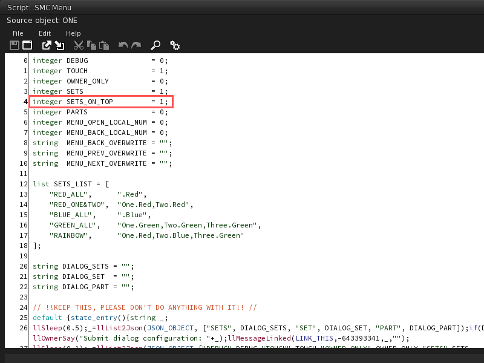
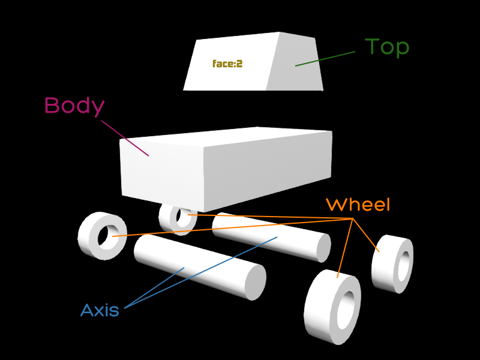
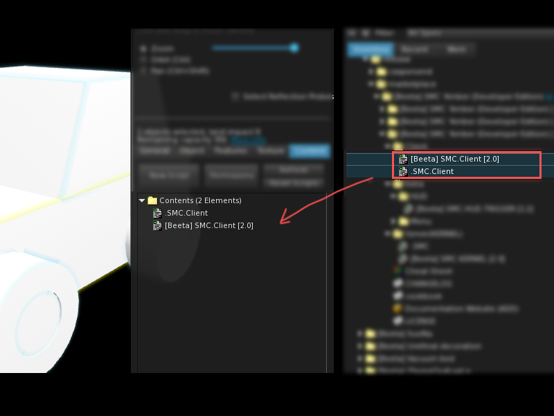
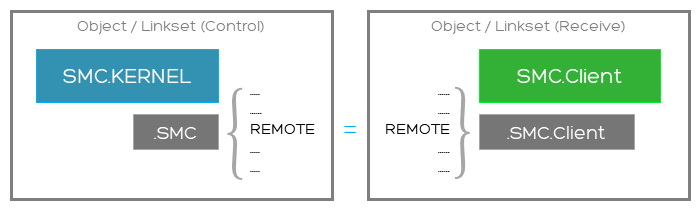
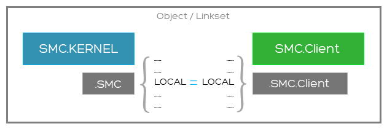

# Smart Material Changer

**'Amber**

Version: 2.0 PBR

[PDF Document](https://iobeeta.github.io/docs/Smart%20Material%20Changer%20'Amber/Smart%20Material%20Changer%20%27Amber.pdf)

## Introduction

- It's based on script configuration instead of notecard. Faster loading/transfer speed, edits freely.
- Kernel and product functions are separated. Can support menu, HUD form, local and remote control.
- Easy to extend and no bound.
- Intelligent matching rules.

Ps: Notecard is not used for configuration because it loads too slow, so fucking slow, so fucking fucking ... slow.

## Script list

### Sender (KERNEL)

| Script | description |
|---|---|
| SMC.KERNEL | Kernel, Material Manager, Memory. |
| .SMC | Configuration for KERNEL. |

### Client (loader)

| Script | description |
|---|---|
| SMC.Client | Material matching applicator. Place it into the object which material needs to be replaced. Get messages from Kernel |
| .SMC.Client | Configuration for SMC.Client |

### Others

| Script | description |
|---|---|
| SMC.HUD.TRIGGER | For HUD, Replace Linkset material in PART.SET format with description of the Prim  |
| SMC.Menu | Replace material by clicking on the pop-up menu and selecting PART and SET. |
| .SMC.Menu | Configuration for SMC.Menu |

## Scripting relationships

**Put ".SMC" and "SMC.KERNEL" together.**


**Put ".SMC.Client" and "SMC.Client" together.**


**Put ".SMC.Menu" and "SMC.Menu" together, and they must be accompanied by KERNEL.**


## Configuration files

All parts in the red box can be edited.

**.SMC**


**.SMC.Client**


**.SMC.Menu**


## Quick Start

### Menu application

Implement material replacement directly on the object through a menu.

| Perpare ||
|---|---|
| Prepare a linkset containing three 6-sided boxes. | Prepare three textures to be used for changing the diffuse. |
|  |  |

Planning to replace all faces of the box within the red outline, the faces of the box within the green outline, and the faces of the box within the yellow outline. Let them to switch between **red**, **green**, and **blue** diffuse textures.

**In edit mode, use the face selector to view the face numbers.**

| Rename prims |||
|---|---|---|
| Rename the prim to "ONE" | Rename the prim to "TWO" | Rename the prim to "THREE" |
|  |  |  |

Now, there are faces that can be precisely located:

- **All faces** of the prim named **"ONE"**
- Face **0** of the prim named **"TWO"**
- Face **4** of the prim named **"THREE"**

| Place the script |
|---|
| Drag and drop the required script. Due to using the menu mode, KERNEL, Client, Menu, and their configuration files will all be placed into the "Contents" of the object.|
|  |

| Edit .SMC |
|---|
| Define all parts with **unique** names, specify matching patterns and content, and faces.<br>**PART**'s definition resembles that of a **selector** or **locator**, detailing how to find the target face. |
|  |
| Define three textures for different colors and give them names.<br>Each PART will switch between three styles, so all three variations need to be fully specified.<br>**Note: The name of SET must be unique within one PART.** |
|  |

| Edit .SMC and .SMC.Client |
|---|
| Adjust LOCAL to the same non-zero value. |
|  |

| Edit .SMC.Menu |
|---|
| Set TOUCH = 1, Enable touch. |
|  |

| Try ||
|---|---|
|  |  |

**OWNER_ONLY = 1** restricts menu to owner-only trigger.

**About SETS**

SETS allows you to conveniently batch execute replacements for multiple PARTs.

You can enable the "SETS" functionality in the .SMC.Menu settings. Here are the details below.

| CODE | PREVIEW |
|---|---|
| SETS = 1 | The menu will include an option labeled **\[SETS\]**. |
|  |  |
| Write SETS_LIST | Click **\[SETS\]** to display all sets. |
|  |  |
| SETS_ON_TOP = 1 | Display the set list in the top-level menu (partial change not available). |
|  |  |
| PARTS = 1 | Add the option **\[PARTS\]** to the set list to enable and perform partial actions. |
|  |  |

### HUD application

| Product ||
|---|---|
| Prepare the product | Plan and name the sub-prims it contains. |
|  |  |

Furthermore, face 2 on the top will be made of glass. The plan for the PARTs are as follows:

- PART Top: Top, 01345
- PART Body: Body, ALL_SIDES
- PART Axis: Axis, ALL_SIDES
- PART Wheel: Wheel, ALL_SIDES
- PART Glass: Top, 2

| Textures |
|---|
| Using 3 textures |
|  |

**Body**, **Top**, **Axis**, **Wheel** each have **Red**, **Green**, **Blue**. The plan for **Glass** in development involves using **TEXTURE_BLANK** for simultaneous coloring. Let it have 2 styles, **Cool** and **Warm**.

| Prepare HUD |
|---|
| Create a HUD, add the required buttons, and link them. |
|  |

| Edit the descriptions for the sub-prims. | |
|---|---|
| The **Main** set of buttons will control the **Top** and **Body** sections. Main in **Red** includes **Top.Red** and **Body.Red**.| **Wheel.Blue**. The other buttons similarly. |
|  |  |

A single button can perform batch operations, similar to SETS in Menu mode. You can also omit the **PART** section and simply write **.SET** to achieve full replacement.

| Place scripts ||
|---|---|
| Placing scripts for HUD. | Placing scripts for product. |
|  |  |

| Edit **.SMC** in the HUD |
|---|
|  |

| Edit **.SMC** in the HUD and **.SMC.Client** in the product |
|---|
|  |

| Try |
|---|
| Touch buttons |
|  |

## Scenario example

**A suit with HUD**

- Put SMC.KERNEL into the HUD.
  - SMC.HUD.TRIGGER is optional. And it's flexible to write if you know about LSL script.
- Put SMC.Client into the suit.
- Make sure the same REMOTE in both SMC.KERNEL and SMC.Client.

**A suit, with menu pops up when click on the collar**

- Put SMC.KERNEL、SMC.Client、SMC.Menu into the suit。
  - You can put these scripts in ROOT or collar. That depends on where you want the menu pops up by click.
- Make sure the same LOCAL in both SMC.KERNEL and SMC.Client.

**A house, with control pad. And the house and pad is linked. Menu pops up when click on.**

- Put SMC.KERNEL、SMC.Client into any PRIM of the house. Set the same LOCAL for both.
- Put the SMC.Menu into the control pad, and ture on the TOUCH.

**A house, with control pad. And the house and pad isn't linked. Menu pops up when click on.**

- Put SMC.Client into any PRIM of the house.
- Put SMC.KERNEL、SMC.Menu into the control pad and turn on the TOUCH.
- Make sure the same REMOTE in both SMC.KERNEL and SMC.Client.

**A house with 2 control pads. One is linked to the house. Another one is in your inventory, works as HUD.**

- Put SMC.Client、SMC.KERNEL、SMC.Menu into any PRIM of the house, and turn on the TOUCH.
- Put SMC.KERNEL、SMC.Menu into the linked control pad, and turn on the TOUCH.
- Put SMC.KERNEL、SMC.Menu into the portable control pad HUD.
- Make sure the same LOCAL in both SMC.Client and SMC.KERNEL.
- Make sure the same REMOTE in all the SMC.KERNEL and SMC.Client.

*Attention! **SMC.HUD.TRIGGER** only works with independent **PRIM** buttons **HUD**. It depends on different name and description. It will not work with only one **PRIM**, since it **can not** recognize the touch position **(ST/UV)**. If need such function, you could write your own script.*

## Deployment

Smart Material Changer (SMC) operates by pairing through REMOTE or LOCAL, matching values are sufficient, with "0" considered invalid.

### Remote control

Remote material change refers to one object(linkset) controlling another object(linkset), requiring that the **REMOTE** in the controlling(kernel) **.SMC** file matches the **REMOTE** in the controlled(client) **.SMC.Client** file.



### Local control

Local material change refers to a single object(linkset), placing the controlling(kernel) and controlled(client) together. requiring that the **LOCAL** in the **.SMC** file matches the **LOCAL** in the **.SMC.Client** file.



### Multiple

In the same linkset, they can function as long as their LOCAL is the same, regardless of which prim they are placed in. Of course, each prim can have at most one kernel and one client.

Kernel and Client can be 1v1, 1vN, Nv1, or NvN.


## Configure

### .SMC

| Configuration | Type | Value | Default | description |
|---|---|---|---|---|
| DEBUG | integer | 0 / 1 | 0 | Debug mode, when enabled, outputs more information |
| LOCAL | integer | -2147483648 ~ 2147483647 (0 invalid) | 0 | Local communication channels, mostly used in menu format |
| REMOTE | integer | -10000 ~ 10000 | 0 | Remote Communication Channel Offset（Note: This is private channel offset, not the exact channel），mostly used in HUD format |
| CACHE | integer | 0/1 | 0 | Resource buffer(UUID).If there are a lot of reused images in the configuration, we recommend turnning this. It could save much RAM |
| RANGE | integer | 0/1/2/3 | 0 | Control distance，0:10m, 1:20m, 2:100m, 3:all region |
| LINES | list |  |  | Detailed writing rules will be described below |

#### LINES

##### PART

Part/Target/Picker

- PART is one or many targets (prim & face), which material could be changed.It's also like a picker.
- There must be **4 parameters** after the PART.

```lsl
list LINES = [
  PART, "{name}", {matching type}, "{matching text}", {face(es)}
];
```

| Parameters | Type | Value | description |
|---|---|---|---|
| name | string | any | In a set of LINES configurations, it's not repeatable. This is one of the keys to change material. It will also work as option in local menu format |
| matching type | integer | table below | Describe the type of match |
| matching text | string/integer | any | Name or description for matching, to define with parameter 2 |
| face(es) | string/integer | -1~7/"01234567"/ALL_SIDES | Which face of the target PRIM. Then number of PRIM(0-7).<br>It could transfer string such as "0267". It will match mutiple face. And no need to follow the order, but can not be repetitive.<br>You can also use ALL_SIDES(-1),and no more face then, since ALL_SIDES include every face |

**Matching type**

| Constant | Value | Description |
|---|---|---|
| FULL | 0 | Match full text of the PRIM name |
| PREFIX | 1 | Match the prefix of the PRIM name |
| SUFFIX | 2 | Match the suffix of the PRIM name |
| SMART | 3 | (temporarily unavailable) Intelligent matching of PRIM names |
| CONST | 4 | In the manner of constants in SL. The matching text could be: LINK_SET, LINK_ALL_CHILDREN, LINK_ALL_OTHERS, LINK_ROOT, LINK_THIS |
| DFULL | 10 | Match full text of the PRIM description |
| DPREFIX | 11 | Match the prefix of the PRIM description |
| DSUFFIX | 12 | Match the suffix of the PRIM description |
| DSMART | 13 | (temporarily unavailable) Intelligent matching of PRIM description |

**Examples**

Match the **3,4** faces of PRIM with named "**A**".

```lsl
list LINES = [
  PART, "Part A", FULL, "A", "34"
];
```

Match **ALL** faces of the PRIM with prefix named **Rect**.

```lsl
list LINES = [
  PART, "All part starting with Rect", PREFIX, "Rect", ALL_SIDES
];
```

Match the **0** face of the PRIM with suffix named **3**.

```lsl
list LINES = [
  PART, "All part ending with 3", SUFFIX, "3", 0
];
```

Match the **1、2、5** faces of the "**PRIMs other than the one where the script in**".

```lsl
list LINES = [
  PART, "All others", CONST, LINK_ALL_OTHERS, "125"
];
```

Match **ALL** faces of the PRIM with **description suffix "top"**.

```lsl
list LINES = [
  PART, "TOP", DSUFFIX, "top", ALL_SIDES
];
```

##### SET

Color/Theme/Material scheme

- SET is a material scheme, and free to configure.
- The definition of SET cannot be independent.**It must be behind a part**.
- There are many properties in a SET. The amounts of properties parameters are different.

```lsl
list LINES = [
  PART, ...,
  SET, "{name}", {property}, {values...}, {property}, {values...}
];
```

**Property**

Refer to [PRIM_TEXTURE](https://wiki.secondlife.com/wiki/LlSetPrimitiveParams#PRIM_TEXTURE)

| Property | Number | Corresponding Property | Description | Number of parameters | Value | Remark |
|---|---|---|---|---|---|---|
| D | 0 | [PRIM_TEXTURE](https://wiki.secondlife.com/wiki/LlSetPrimitiveParams#PRIM_TEXTURE) | Diffuse texture | 1 | {texture} | Only change the texture, others are inherited |
| DP | 1 | [PRIM_TEXTURE](https://wiki.secondlife.com/wiki/LlSetPrimitiveParams#PRIM_TEXTURE) | Diffuse(detail) | 4 | {texture}, {repeats}, {offsets}, {rotation_in_radians} | Set all properties related to diffuse reflection |
| N | 2 | [PRIM_NORMAL](https://wiki.secondlife.com/wiki/LlSetPrimitiveParams#PRIM_NORMAL) | Normal texture | 1 | {texture} | Only change the texture, others are inherited |
| NP | 3 | [PRIM_NORMAL](https://wiki.secondlife.com/wiki/LlSetPrimitiveParams#PRIM_NORMAL) |  Normal(detail) | 4 | {texture}, {repeats}, {offsets}, {rotation_in_radians} | Set all properties related to normal mapping |
| S | 4 | [PRIM_SPECULAR](https://wiki.secondlife.com/wiki/LlSetPrimitiveParams#PRIM_SPECULAR) | Specular texture | 1 | {texture} | Only change the texture, others are inherited |
| SP | 5 | [PRIM_SPECULAR](https://wiki.secondlife.com/wiki/LlSetPrimitiveParams#PRIM_SPECULAR) |Specular(detail) | 7 | {texture}, {repeats}, {offsets}, {rotation_in_radians}, {color}, {glossiness}, {environment} | Set all properties related to gloss |
| C | 6 | [PRIM_COLOR](https://wiki.secondlife.com/wiki/LlSetPrimitiveParams#PRIM_COLOR) | Color | 1 | {color} | Color and alpha can be set separately |
| A | 7 | [PRIM_COLOR](https://wiki.secondlife.com/wiki/LlSetPrimitiveParams#PRIM_COLOR) | Alpha | 1 | {alpha} | Color and alpha can be set separately |
| G | 8 | [PRIM_GLOW](https://wiki.secondlife.com/wiki/LlSetPrimitiveParams#PRIM_GLOW) | Glow | 1 | {glow} | Light like a bulb |
| F | 9 | [PRIM_FULLBRIGHT](https://wiki.secondlife.com/wiki/LlSetPrimitiveParams#PRIM_FULLBRIGHT) | Full bright | 1 | {boolean} | Turn on or off |
| B | 10 | [PRIM_BUMP_SHINY](https://wiki.secondlife.com/wiki/LlSetPrimitiveParams#PRIM_BUMP_SHINY) | Normal and specular | 2 | {shiny}, {bump} | SL basic normal and specular |
| T | 11 | [PRIM_TEXGEN](https://wiki.secondlife.com/wiki/LlSetPrimitiveParams#PRIM_TEXGEN) | Mapping mode | 1 | {mode} | Default/Plane |
| M | 12 | [PRIM_ALPHA_MODE](https://wiki.secondlife.com/wiki/LlSetPrimitiveParams#PRIM_ALPHA_MODE) | Alpha mode | 2 | {alpha_mode}, {mask_cutoff} | The 2nd parameter can not be omit, whether or not with the mask |
| GR | 13 | [PRIM_RENDER_MATERIAL](https://wiki.secondlife.com/wiki/LlSetPrimitiveParams#PRIM_RENDER_MATERIAL) | Material settings | 1 | {render_material} | A material in the inventory of the prim this script is in or a UUID of a material |
| GB | 14 | [PRIM_GLTF_BASE_COLOR](https://wiki.secondlife.com/wiki/LlSetPrimitiveParams#PRIM_GLTF_BASE_COLOR) | GLTF Base texture | 1 | {texture} | Only change the texture, others are inherited |
| GBC | 15 | [PRIM_GLTF_BASE_COLOR](https://wiki.secondlife.com/wiki/LlSetPrimitiveParams#PRIM_GLTF_BASE_COLOR) | GLTF Base color | 1 | {color} | Only change the color, others are inherited |
| GBA | 16 | [PRIM_GLTF_BASE_COLOR](https://wiki.secondlife.com/wiki/LlSetPrimitiveParams#PRIM_GLTF_BASE_COLOR) | GLTF Base alpha | 1 | {alpha} | Only change the alpha, others are inherited |
| GBM | 17 | [PRIM_GLTF_BASE_COLOR](https://wiki.secondlife.com/wiki/LlSetPrimitiveParams#PRIM_GLTF_BASE_COLOR) | GLTF Base alpha mode | 2 | {gltf_alpha_mode}, {alpha_mask_cutoff} | Only change the alpha mode, others are inherited |
| GBD | 18 | [PRIM_GLTF_BASE_COLOR](https://wiki.secondlife.com/wiki/LlSetPrimitiveParams#PRIM_GLTF_BASE_COLOR) | GLTF Base double sided | 1 | {double_sided} | Only change the double sided, others are inherited |
| GBP | 19 | [PRIM_GLTF_BASE_COLOR](https://wiki.secondlife.com/wiki/LlSetPrimitiveParams#PRIM_GLTF_BASE_COLOR) | GLTF Base(detail) | 9 | {texture}, {repeats}, {offsets}, {rotation_in_radians}, {color}, {alpha}, {gltf_alpha_mode}, {alpha_mask_cutoff}, {double_sided} | Set all properties related to GLTF Base |
| GN | 20 | [PRIM_GLTF_NORMAL](https://wiki.secondlife.com/wiki/LlSetPrimitiveParams#PRIM_GLTF_NORMAL) | GLTF Normal texture | 1 | {texture} | Only change the texture, others are inherited |
| GNP | 21 | [PRIM_GLTF_NORMAL](https://wiki.secondlife.com/wiki/LlSetPrimitiveParams#PRIM_GLTF_NORMAL) | GLTF Normal(detail) | 4 | {texture}, {repeats}, {offsets}, {rotation_in_radians} | Set all properties related to GLTF Normal |
| GM | 22 | [PRIM_GLTF_METALLIC_ROUGHNESS](https://wiki.secondlife.com/wiki/LlSetPrimitiveParams#PRIM_GLTF_METALLIC_ROUGHNESS) | GLTF Metallic & Roughness texture | 1 | {texture} | Only change the texture, others are inherited |
| GMM | 23 | [PRIM_GLTF_METALLIC_ROUGHNESS](https://wiki.secondlife.com/wiki/LlSetPrimitiveParams#PRIM_GLTF_METALLIC_ROUGHNESS) | GLTF Metallic | 1 | {metallic_factor} | Only change the metallic, others are inherited |
| GMR | 24 | [PRIM_GLTF_METALLIC_ROUGHNESS](https://wiki.secondlife.com/wiki/LlSetPrimitiveParams#PRIM_GLTF_METALLIC_ROUGHNESS) | GLTF Roughness | 1 | {roughness_factor} | Only change the roughness, others are inherited |
| GMP | 25 | [PRIM_GLTF_METALLIC_ROUGHNESS](https://wiki.secondlife.com/wiki/LlSetPrimitiveParams#PRIM_GLTF_METALLIC_ROUGHNESS) | GLTF Metallic & Roughness(detail) | 6 | {texture}, {repeats}, {offsets}, {rotation_in_radians}, {metallic_factor}, {roughness_factor} | Set all properties related to GLTF Metallic & Roughness |
| GE | 26 | [PRIM_GLTF_EMISSIVE](https://wiki.secondlife.com/wiki/LlSetPrimitiveParams#PRIM_GLTF_EMISSIVE) | GLTF Emissive texture | 1 | {texture} | Only change the texture, others are inherited |
| GET | 27 | [PRIM_GLTF_EMISSIVE](https://wiki.secondlife.com/wiki/LlSetPrimitiveParams#PRIM_GLTF_EMISSIVE) | GLTF Emissive tint | 1 | {color} | Only change the tint, others are inherited |
| GEP | 28 | [PRIM_GLTF_EMISSIVE](https://wiki.secondlife.com/wiki/LlSetPrimitiveParams#PRIM_GLTF_EMISSIVE) | GLTF Emissive(detail) | 5 | {texture}, {repeats}, {offsets}, {rotation_in_radians}, {emissive_tint} | Set all properties related to GLTF Emissive |

**If the value is given as an empty string, it means no replacement (use the current value)**

**Examples**

Change the diffuse reflection mapping, normal mapping with details, alpha and glow.

```lsl
list LINES = [
  PART, ...,
  SET, "name_1", D, "{uuid}", NP, "{uuid}", <1.0, 1.0, 0.0>, <0.0, 0.0, 0.0>, 0.0, A, 0.6, G, 0.02
]
```

Change color, full bright mode, and clean the specular mapping.

```lsl
list LINES = [
  PART, ...,
  SET, "name_2", C, <1.0, 0.0, 0.0>, F, TRUE, S, NULL_KEY
]
```

Change the positon and rotation of diffuse reflection mapping. And keep the map and repeats.

```lsl
list LINES = [
  PART, ...,
  SET, "name_3", DP, "", "", <0.125, 0.4, 0.0>, 135.65
]
```

### .SMC.Client

| Configurations | Type | Values | Default | Description |
|---|---|---|---|---|
| DEBUG | integer | 0 / 1 | 0 | Debug mode, when enabled, outputs more information |
| LOCAL | integer | -2147483648 ~ 2147483647 (0 invalid) | 0 | Local communication channels, mostly used in menu format |
| REMOTE | integer | -10000 ~ 10000 | 0 | Remote communication channel offset (Note: This is private channel offset, not the exact channel), mostly used in HUD format |
| DEBOUNCE | float | ≥ 0.0 | 0.0 | Anti-shake period, any changes in this period will be accumulated until there is no operation to change the material and start to work after this period, to avoid the efficiency bottleneck caused by frequent switching |
| CACHE | integer | 0 / 1 | 0 | Selector caching, use cache for more efficient matching speed. Note: when this option is turned on, you can't do link and unlink operation on the object, or it will be error |

### .SMC.Menu

| Configuration Item | Type | Values | Default | Description |
|---|---|---|---|---|
| DEBUG | integer | 0 / 1 | 0 | Debug mode, when enabled, outputs more information |
| TOUCH | integer | 0 / 1 | 0 | Whether the menu can be triggered by touching |
| OWNER_ONLY | integer | 0 / 1 | 0 | Whether the toucher must be the owner |
| SETS | integer | 0 / 1 | 0 | "SETS" options, adds "\[SETS\]" option in the PART list, entering the SETS list menu |
| SETS_ON_TOP | integer | 0 / 1 | 0 | Top-level menu, replaces the PART list with the SETS list |
| PARTS | integer | 0 / 1 | 0 | If SETS_ON_TOP is enabled, adds "\[PART\]" in the SETS menu as an entry to the PART menu |
| MENU_OPEN_LOCAL_NUM | integer | -2147483648 ~ 2147483647 (0 invalid) | 0 | Local num triggering menu pop-up |
| MENU_BACK_LOCAL_NUM | integer | -2147483648 ~ 2147483647 (0 invalid) | 0 | Callback to return to the parent menu |
| MENU_BACK_OVERWRITE | string | Any | Empty string | Replace the return option text |
| MENU_PREV_OVERWRITE | string | Any | Empty string | Replace the previous page option text |
| MENU_NEXT_OVERWRITE | string | Any | Empty string | Replace the next page option text |
| DIALOG_SETS | string | Any | Empty string | Set the menu content of SETS. Please use "\n" for line breaks. |
| DIALOG_SET | string | Any | Empty string | Set the menu content of SET. Please use "\n" for line breaks.  |
| DIALOG_PART | string | Any | Empty string | Set the menu content of PART. Please use "\n" for line breaks.  |
| SETS_LIST | list | key/value pairs | Empty list | See below |

#### SETS_LIST

**Formats**

```lsl
list SETS_LIST = [
  "{Set name}", "{PART}.{SET}",
  ...
];

list SETS_LIST = [
  "{Set name}", ".{SET}",
  ...
];

list SETS_LIST = [
  "{Set name}", ".{SET_A},.{SET_B},{PART1}.{SET_C},...",
  ...
];
```

**Examples**

```lsl
list SETS_LIST = [
  "BLACK", ".BLACK"
];
```

```lsl
list SETS_LIST = [
  "BLACK&RED", ".BLACK,.RED"
];
```

```lsl
list SETS_LIST = [
  "BLACK&TOP_RED", ".BLACK,TOP.RED"
];
```

```lsl
list SETS_LIST = [
  "BTM_B&T_R", "BOTTOM.BLACK,TOP.RED"
];
```

## SMC.KERNEL Local Interface

The message string separator is **"�"**

```lsl
llDumpList2String([...], "�")
```

### Submit

**-643323390**

Apply a predefined property to a predefined part and support custom append and override

```lsl
llMessageLinked(LINK_SET, -643323390, "{PART}�{SET}[�{DATA...}]", "");
```

- PART and SET must be defined in the configuration, and SET must belong to PART for this commit to work.
- The DATA part is an append or override attribute, written as in SET, optional parameters.

Examples

```lsl
// Most commonly used (using predefined configuration LINES)
llMessageLinked(LINK_SET, -643323390, "TOP�BLACK", "");
// with customized properties
llMessageLinked(LINK_SET, -643323390, "TOP�BLACK�6�<1.0, 0.0, 0.0>�9�TRUE�4�ee509dfd-0974-6fb5-3eea-2504fa13ef4c", "");
// Easy style
llMessageLinked(LINK_SET, -643323390, llDumpList2String(["TOP", "BLACK", 6, <1.0, 0.0, 0.0>, 9, TRUE, 4, "ee509dfd-0974-6fb5-3eea-2504fa13ef4c"], "�"), "");
// It is recommended to use constants, which can be written as
llMessageLinked(LINK_SET, -643323390, llDumpList2String(["TOP", "BLACK", C, <1.0, 0.0, 0.0>, F, TRUE, S, "ee509dfd-0974-6fb5-3eea-2504fa13ef4c"], "�"), "");
```

\* Batch mode

```lsl
llMessageLinked(LINK_SET, -643323390, "�{SET}", "");
```

- If with no PART, the full match mode will be triggered at this point, and all PARTs containing the SET will be automatically found, and work together.
- The DATA appended at this moment, will be applied to all relevant PARTs.

Examples

```lsl
// In the defined PART, such as TOP, MIDDLE and BOTTOM.
// If there is BLACK in TOP and MIDDLE, those will be found automatically and BLACK will be applied.
// The same with carrying out TOP�BLACK and MIDDLE�BLACK
llMessageLinked(LINK_SET, -643323390, "�BLACK", "");
```

**-643323392**

Apply a customized set of attributes to predefined parts

```lsl
llMessageLinked(LINK_SET, -643323392, "{PART}�{DATA...}", "");
```

- PART must have been defined in the configuration for this commit to work.
- The writing style of DATA, such as properties in SET, is different with those above for the custom properties of PART.

Examples

```lsl
llMessageLinked(LINK_SET, -643323392, "TOP�6�<1.0, 0.0, 0.0>�9�TRUE�4�ee509dfd-0974-6fb5-3eea-2504fa13ef4c", "");
// Easy style
llMessageLinked(LINK_SET, -643323392, llDumpList2String(["TOP", 6, <1.0, 0.0, 0.0>, 9, TRUE, 4, "ee509dfd-0974-6fb5-3eea-2504fa13ef4c"], "�"), "");
// It is recommended to use constants, which can be written as
llMessageLinked(LINK_SET, -643323392, llDumpList2String(["TOP", C, <1.0, 0.0, 0.0>, F, TRUE, S, "ee509dfd-0974-6fb5-3eea-2504fa13ef4c"], "�"), "");
```

**-643323393**

Apply a set of custom properties to a customized part.

```lsl
llMessageLinked(LINK_SET, -643323393, "{DATA...}", "");
```

- DATA must be with the full PART + SET contents.
- No need to follow the configuration, this is a completely independent selection + properties rule.

Examples

```lsl
llMessageLinked(LINK_SET, -643323393, "2�top�0123�6�<1.0, 0.0, 0.0>�9�TRUE�4�ee509dfd-0974-6fb5-3eea-2504fa13ef4c", "");
// Easy style
llMessageLinked(LINK_SET, -643323393, llDumpList2String([2, "top", "0123", 6, <1.0, 0.0, 0.0>, 9, TRUE, 4, "ee509dfd-0974-6fb5-3eea-2504fa13ef4c"], "�"), "");
// It is recommended to use constants, which can be written as
llMessageLinked(LINK_SET, -643323393, llDumpList2String([SUFFIX, "top", "0123", C, <1.0, 0.0, 0.0>, F, TRUE, S, "ee509dfd-0974-6fb5-3eea-2504fa13ef4c"], "�"), "");
```

### Request(pull back)

**-643323410**

Request PART List

```lsl
llMessageLinked(LINK_SET, -643323410, "", id);
```

KERNEL callback: **-643323411**

```lsl
  llMessageLinked({SENDER}, -643323411, "{PART1}�{PART2}�....", id);
```

**-643323420**

Request SET List

```lsl
llMessageLinked(LINK_SET, -643323420, "{SET}", id);
```

KERNEL callback: **-643323411**

```lsl
  llMessageLinked({SENDER}, -643323421, "{SET1}�{SET2}�....", id);
```

\* Special thanks to my darling **Amber0089**
