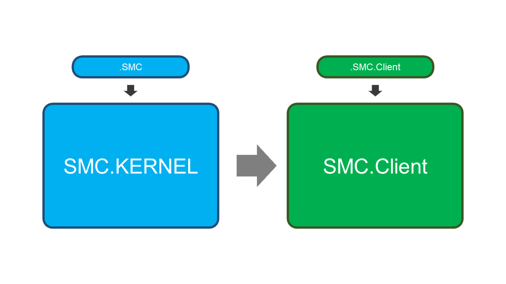
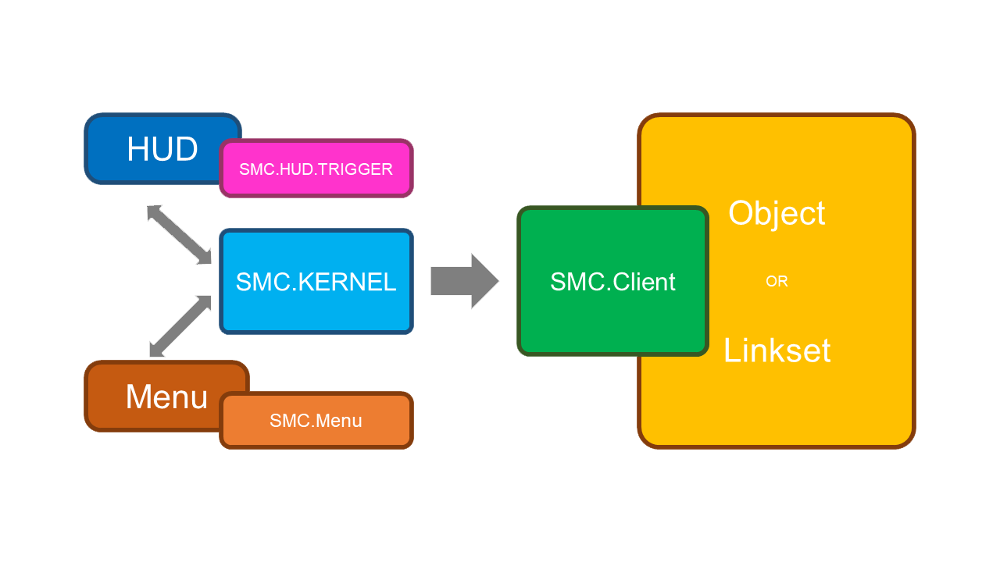
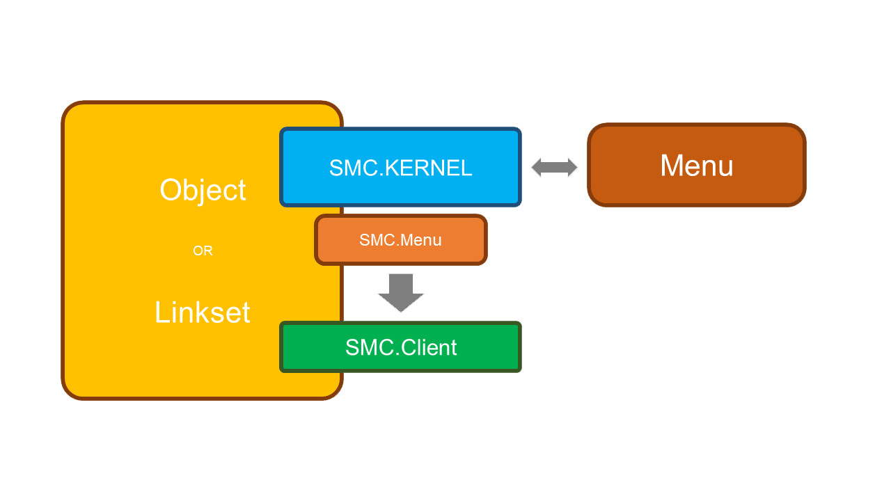
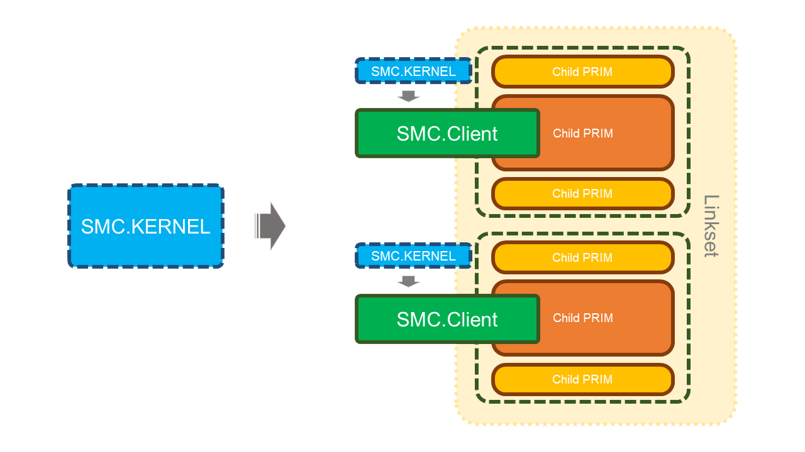
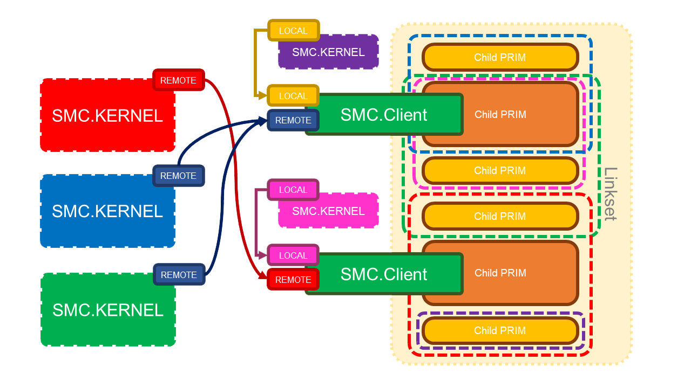

# Smart Material Changer PRO

Version: 1.8

## Introduction

- It's based on script configuration instead of notecard. Faster loading/transfer speed, edits freely.
- Kernel and product functions are separated. Can support menu, HUD form, local and remote control.
- Easy to extend and no bound.
- Intelligent matching rules.

Ps: Notecard is not used for configuration because it loads too slow, so fucking slow, so fucking fucking ... slow.

## Script list

### Sender (KERNEL)

| Script | description |
|---|---|
| SMC.KERNEL | Kernel, Material Manager, Memory. |
| .SMC | Configuration for KERNEL. |

### Client (loader)

| Script | description |
|---|---|
| SMC.Client | Material matching applicator. Place it into the object which material needs to be replaced. Get messages from Kernel |
| .SMC.Client | Configuration for SMC.Client |

### Others

| Script | description |
|---|---|
| SMC.HUD.TRIGGER | For HUD, Replace Linkset material in PART.SET format with description of the Prim  |
| SMC.Menu | Replace material by clicking on the pop-up menu and selecting PART and SET. |
| .SMC.Menu | Configuration for SMC.Menu |

## Schema

### Scripting relationships



### Remote



### Local



### Remote/Local

**Multiple deployment**

- **Multiple SMC.Clients can be placed in different prims in the same linkset, and they can work for their own parts, controlled by one or more SMC.KERNELs.**
- **Multiple sets of SMC.KERNEL + SMC.Client can be placed in different prims in the same linkset to control multiple sets of rules with by local.**



### Remote/Local cross

**Multiple deployment and cross control**

- **Use REMOTE, LOCAL for pairing between SMC.KERNEL and SMC.Client, Allow one-to-many, many-to-one, many-to-many.**
- **Multiple KERNEL control ranges are allowed to intersect, e.g., controlling mapping and color.**



## User guide

Common applications

### Menu application

Click on the object, linkmessage, or gesture to bring up the menu and choose to replace the material.

- Prepare a target object to be replaced material, such as perm, mesh, or linkset.
- Put in scripts
  - SMC.KERNEL
    - .SMC
  - SMC.Client
    - .SMC.Client
  - SMC.Menu
    - .SMC.Menu
- Edit configuration information in .SMC, .SMC.Client, .SMC.Menu.
- Change the name or descrition of the Prim.
- (Recommended) **.SMC.Client**、**.SMC.Menu** You can delete it after saving it, or putting it into an object.
- (Recommended) input **/finalise** in local chat, fix the KERNEL configuration, then you can delet **.SMC**.
- Click the object to use.

**The"LOCAL" in .SMC and .SMC.Client must be the same.**

### HUD application

Material change via HUD communication with target object, remote control.

- Prepare an object as the HUD.
- Put in script
  - SMC.KERNEL
    - .SMC
  - (options) **SMC.HUD.TRIGGER**，A sample HUD Button Click Trigger.
    - Write the defined PART and SET in the description of the HUD's buttons. Separated each by ".", such as **PartA.Style1**. The SET must be set, and the PART can be omitted. If without PART, such as：**.Style1**,the script will replace all the PART with**Style1**.
    - You can develop the trigger script for HUD, for more functions, such as slider and color picker.
- Edit configuration information in **.SMC**
- (Recommended) input **/finalise** in local chat, fix the KERNEL configuration, then you can delet **.SMC**.
- Prepare another target object to be replaced material, such as perm, mesh, or linkset.
- Put in script
  - SMC.Client
    - .SMC.Client
- (Recommended) Edit configuration in **.SMC.Client**，you can delet it after saving or putting into object.
- Rename the prim of linkset.
- Click the HUD to use.

**The "REMOTE" in .SMC and .SMC.Client must be the same.**

### Remote Menu

Another type of remote control, base on menus instead of HUDs.

- Prepare an object that can trigger the menu
- put in scripts
  - SMC.KERNEL
    - .SMC
  - SMC.Menu
    - .SMC.Menu
- edit configuration in .SMC and .SMC.Menu
- (Recommended) **.SMC.Menu** You can delete it after saving it, or putting it into an object.
- (Recommended) input **/finalise**in local chat，fix the KERNEL configuration, then you can delet **.SMC**.
- Prepare another target object to be replaced material, such as perm, mesh, or linkset.
- Put in script
  - SMC.Client
    - .SMC.Client
- (Recommended) Edit configuration in **.SMC.Client**，you can delet it after saving or putting into object.
- Rename the prim of linkset.
- Click the HUD to use.

**The "REMOTE" in .SMC and .SMC.Client must be the same.**

## Scenario example

**A suit with HUD**

- Put SMC.KERNEL into the HUD.
  - SMC.HUD.TRIGGER is optional. And it's flexible to write if you know about LSL script.
- Put SMC.Client into the suit.
- Make sure the same REMOTE in both SMC.KERNEL and SMC.Client.

**A suit, with menu pops up when click on the collar**

- Put SMC.KERNEL、SMC.Client、SMC.Menu into the suit。
  - You can put these scripts in ROOT or collar. That depends on where you want the menu pops up by click.
- Make sure the same LOCAL in both SMC.KERNEL and SMC.Client.

**A house, with control pad. And the house and pad is linked. Menu pops up when click on.**

- Put SMC.KERNEL、SMC.Client into any PRIM of the house. Set the same LOCAL for both.
- Put the SMC.Menu into the control pad, and ture on the TOUCH.

**A house, with control pad. And the house and pad isn't linked. Menu pops up when click on.**

- Put SMC.Client into any PRIM of the house.
- Put SMC.KERNEL、SMC.Menu into the control pad and turn on the TOUCH.
- Make sure the same REMOTE in both SMC.KERNEL and SMC.Client.

**A house with 2 control pads. One is linked to the house. Another one is in your inventory, works as HUD.**

- Put SMC.Client、SMC.KERNEL、SMC.Menu into any PRIM of the house, and turn on the TOUCH.
- Put SMC.KERNEL、SMC.Menu into the linked control pad, and turn on the TOUCH.
- Put SMC.KERNEL、SMC.Menu into the portable control pad HUD.
- Make sure the same LOCAL in both SMC.Client and SMC.KERNEL.
- Make sure the same REMOTE in all the SMC.KERNEL and SMC.Client.

*Attention! **SMC.HUD.TRIGGER** only works with independent **PRIM** buttons **HUD**. It depends on different name and description. It will not work with only one **PRIM**, since it **can not** recognize the touch position **(ST/UV)**. If need such function, you could write your own script.*

## Configure

### .SMC

| Configuration | Type | Value | Default | description |
|---|---|---|---|---|
| LOCAL | integer | -2147483648 ~ 2147483647 (0 无效) | 0 | Local communication channels, mostly used in menu format |
| REMOTE | integer | -10000 ~ 10000 | 0 | Remote Communication Channel Offset（Note: This is private channel offset, not the exact channel），mostly used in HUD format |
| CACHE | integer | 0/1 | 0 | Resource buffer(UUID).If there are a lot of reused images in the configuration, we recommend turnning this. It could save much RAM 
| RANGE | integer | 0/1/2/3 | 0 | Control distance，0:10m, 1:20m, 2:100m, 3:all region |
| LINES | list |  |  | Detailed writing rules will be described below |

#### LINES

**PART**

Part/Target/Picker

- PART is one or many targets (prim & face), which material could be changed.It's also like a picker.
- There must be **4 parameters** after the PART.

```lsl
list LINES = [
  PART, "{name}", {matching type}, "{matching text}", {face(es)}
];
```

| Parameters | Type | Value | description |
|---|---|---|---|
| name | string | any | In a set of LINES configurations, it's not repeatable. This is one of the keys to change material. It will also work as option in local menu format |
| matching type | integer | table below | Describe the type of match |
| matching text | string/integer | Name or description for matching, to define with parameter 2 |
| face(es) | string/integer | Which face of the target PRIM. Then number of PRIM(0-7).<br>It could transfer string such as "0267". It will match mutiple face. And no need to follow the order, but can not be repetitive.<br>You can also use ALL_SIDES(-1),and no more face then, since ALL_SIDES include every face

**Matching type**

| Constant | Value | description |
|---|---|---|
| FULL | 0 | Match full text of the PRIM name|
| PREFIX | 1 | Match the prefix of the PRIM name|
| SUFFIX | 2 | Match the suffix of the PRIM name|
| SMART | 3 | Intelligent matching of PRIM names (temporarily unavailable) |
| CONST | 4 | In the manner of constants in SL. The matching text could be: LINK_SET, LINK_ALL_CHILDREN, LINK_ALL_OTHERS, LINK_ROOT, LINK_THIS |
| DFULL | 10 | Match full text of the PRIM description |
| DPREFIX | 11 | Match the prefix of the PRIM description |
| DSUFFIX | 12 | Match the suffix of the PRIM description |
| DSMART | 13 | Intelligent matching of PRIM description (temporarily unavailable) |

**Examples**

Match the **3,4** faces of PRIM with named "**A**".

```lsl
list LINES = [
  PART, "Part A", FULL, "A", "34"
];
```

Match **ALL** faces of the PRIM with prefix named **Rect**.

```lsl
list LINES = [
  PART, "All part starting with Rect", PREFIX, "Rect", ALL_SIDES
];
```

Match the **0** face of the PRIM with suffix named **3**.

```lsl
list LINES = [
  PART, "All part ending with 3", SUFFIX, "3", 0
];
```

Match the **1、2、5** faces of the "**PRIMs other than the one where the script in**".

```lsl
list LINES = [
  PART, "All others", CONST, LINK_ALL_OTHERS, "125"
];
```

Match **ALL** faces of the PRIM with **description suffix "top"**.

```lsl
list LINES = [
  PART, "TOP", DSUFFIX, "top", ALL_SIDES
];
```

**SET**

Color/Theme/Material scheme

- SET is a material scheme, and free to configure.
- The definition of SET cannot be independent.**It must be behind a part**.
- There are many properties in a SET. The amounts of properties parameters are different.

```lsl
list LINES = [
  PART, ...,
  SET, {property}, ..., {property}, ..., {property}, ...
];
```

#### Properties

Refer to [PRIM_TEXTURE](https://wiki.secondlife.com/wiki/LlSetPrimitiveParams#PRIM_TEXTURE)

| Properties | Number | Corresponding Properties | Descriptions | Number of parameters | Value | Remark |
|---|---|---|---|---|---|---|
| D | 0 | [PRIM_TEXTURE](https://wiki.secondlife.com/wiki/LlSetPrimitiveParams#PRIM_TEXTURE) | Diffuse reflection mapping | 1 | "{UUID}" | Only change the map, others are inherited |
| DP | 1 | [PRIM_TEXTURE](https://wiki.secondlife.com/wiki/LlSetPrimitiveParams#PRIM_TEXTURE) | Diffuse reflection mapping (detail) | 4 | "{UUID}", {repeats}, {position}, {rotation} | Set all properties related to diffuse reflection |
| N | 2 | [PRIM_NORMAL](https://wiki.secondlife.com/wiki/LlSetPrimitiveParams#PRIM_NORMAL) | Normal mapping | 1 | "{UUID}" | Only change the map, others are inherited |
| NP | 3 | [PRIM_NORMAL](https://wiki.secondlife.com/wiki/LlSetPrimitiveParams#PRIM_NORMAL) |  Normal mapping (detail) | 4 | "{UUID}", {repeats}, {position}, {rotation} | Set all properties related to normal mapping |
| S | 4 | [PRIM_SPECULAR](https://wiki.secondlife.com/wiki/LlSetPrimitiveParams#PRIM_SPECULAR) | Specular mapping | 1 | "{UUID}" | Only change the map, others are inherited |
| SP | 5 | [PRIM_SPECULAR](https://wiki.secondlife.com/wiki/LlSetPrimitiveParams#PRIM_SPECULAR) |Specular mapping (detail) | 7 | "{UUID}", {repeats}, {position}, {rotation}, {reflective color}, {glossiness}, {environment} | Set all properties related to gloss |
| C | 6 | [PRIM_COLOR](https://wiki.secondlife.com/wiki/LlSetPrimitiveParams#PRIM_COLOR) | Color | 1 | {Color} | Color and alpha can be set separately
| A | 7 | [PRIM_COLOR](https://wiki.secondlife.com/wiki/LlSetPrimitiveParams#PRIM_COLOR) | Alpha | 1 | {Alpha} | Color and alpha can be set separately
| G | 8 | [PRIM_GLOW](https://wiki.secondlife.com/wiki/LlSetPrimitiveParams#PRIM_GLOW) | Glow | 1 | {Glow} | Light like a bulb |
| F | 9 | [PRIM_FULLBRIGHT](https://wiki.secondlife.com/wiki/LlSetPrimitiveParams#PRIM_FULLBRIGHT) | Full bright | 1 | {TRUE/FALSE} | Turn on or off |
| B | 10 | [PRIM_BUMP_SHINY](https://wiki.secondlife.com/wiki/LlSetPrimitiveParams#PRIM_BUMP_SHINY) | Normal and specular | 2 | {Level}, {Mode} | SL basic normal and specular |
| T | 11 | [PRIM_TEXGEN](https://wiki.secondlife.com/wiki/LlSetPrimitiveParams#PRIM_TEXGEN) | Mapping mode | 1 | {Mode} | Default/Plane |
| M | 12 | [PRIM_ALPHA_MODE](https://wiki.secondlife.com/wiki/LlSetPrimitiveParams#PRIM_ALPHA_MODE) | Alpha mode | 2 | {Mode}, {Mask cutoff} | The 2nd parameter can not be omit, whether or not with the mask  |

**If the value is given as an empty string, it means no replacement (use the current value)**

**Examples**

Change the diffuse reflection mapping, normal mapping with details, alpha and glow.

```lsl
list LINES = [
  PART, ...,
  SET, "name_1", D, "{uuid}", NP, "{uuid}", <1.0, 1.0, 0.0>, <0.0, 0.0, 0.0>, 0.0, A, 0.6, G, 0.02
]
```

Change color, full bright mode, and clean the specular mapping.

```lsl
list LINES = [
  PART, ...,
  SET, "name_2", C, <1.0, 0.0, 0.0>, F, TRUE, S, NULL_KEY
]
```

Change the positon and rotation of diffuse reflection mapping. And keep the map and repeats.

```lsl
list LINES = [
  PART, ...,
  SET, "name_3", DP, "", "", <0.125, 0.4, 0.0>, 135.65
]
```

### .SMC.Client

| Configurations | Type | Values | Default | Description |
|---|---|---|---|---|
| LOCAL | integer | -2147483648 ~ 2147483647 (0 not valid) | 0 | Local communication channels, mostly used in menu format |
| REMOTE | integer | -10000 ~ 10000 | 0 | Remote communication channel offset (Note: This is private channel offset, not the exact channel), mostly used in HUD format |
| DEBOUNCE | float | ≥ 0.0 | 0.0 | Anti-shake period, any changes in this period will be accumulated until there is no operation to change the material and start to work after this period, to avoid the efficiency bottleneck caused by frequent switching |
| CACHE | integer | 0 / 1 | 0 | Selector caching, use cache for more efficient matching speed. Note: when this option is turned on, you can't do link and unlink operation on the object, or it will be error |

### .SMC.Menu

| Configurations | Type | Values | Default | Description |
|---|---|---|---|---|
| TOUCH | integer | 0 / 1 | 0 | Whether the popup menu can be triggered by clicking on it |
| OWNER_ONLY | integer | 0 / 1 | 0 | Whether the user must be the owner |
| MENU_POPUP_CHANNEL_LOCAL | integer | -2147483648 ~ 2147483647 (0 not valid) | 0 | Trigger menu popups locally |
| MENU_BACK_TRIGGER_CHANNEL_LOCAL | integer | -2147483648 ~ 2147483647 (0 无效) | 0 | Callbacks to return to the previous menu level |
| SETS | integer | 0 / 1 | 0 | Set options, add an item "\[SETS\]" to the PART list and enter the Set List menu |
| SETS_ON_TOP | integer | 0 / 1 | 0 | The top menu PART list has been replaced with a set list |
| PARTS | integer | 0 / 1 | 0 | If the SETS_ON_TOP is turned on, Add an item "\[PART\]" to the Set menu to still allow changing by parts |
| SETS_LIST | integer | 0 / 1 | 0 | See below |

#### SETS_LIST

**Formats**

```lsl
list SETS_LIST = [
  "{Set name}", "{PART}.{SET}",
  ...
];

list SETS_LIST = [
  "{Set name}", ".{SET}",
  ...
];

list SETS_LIST = [
  "{Set name}", ".{SET_A},.{SET_B},{PART1}.{SET_C},...",
  ...
];
```

**Examples**

```lsl
list SETS_LIST = [
  "BLACK", ".BLACK"
];
```

```lsl
list SETS_LIST = [
  "BLACK&RED", ".BLACK,.RED"
];
```

```lsl
list SETS_LIST = [
  "BLACK&TOP_RED", ".BLACK,TOP.RED"
];
```

```lsl
list SETS_LIST = [
  "BTM_B&T_R", "BOTTOM.BLACK,TOP.RED"
];
```

## SMC.KERNEL Local Interface

The message string separator is **"�"**

```lsl
llDumpList2String([...], "�")
```

### Submit

**-643323390**

Apply a predefined property to a predefined part and support custom append and override

```lsl
llMessageLinked(LINK_SET, -643323390, "{PART}�{SET}[�{DATA...}]", "");
```

- PART and SET must be defined in the configuration, and SET must belong to PART for this commit to work.
- The DATA part is an append or override attribute, written as in SET, optional parameters.

Examples

```lsl
// Most commonly used (using predefined configuration LINES)
llMessageLinked(LINK_SET, -643323390, "TOP�BLACK", "");
// with customized properties
llMessageLinked(LINK_SET, -643323390, "TOP�BLACK�6�<1.0, 0.0, 0.0>�9�TRUE�4�ee509dfd-0974-6fb5-3eea-2504fa13ef4c", "");
// Easy style
llMessageLinked(LINK_SET, -643323390, llDumpList2String(["TOP", "BLACK", 6, <1.0, 0.0, 0.0>, 9, TRUE, 4, "ee509dfd-0974-6fb5-3eea-2504fa13ef4c"], "�"), "");
// It is recommended to use constants, which can be written as
llMessageLinked(LINK_SET, -643323390, llDumpList2String(["TOP", "BLACK", C, <1.0, 0.0, 0.0>, F, TRUE, S, "ee509dfd-0974-6fb5-3eea-2504fa13ef4c"], "�"), "");
```

\* Batch mode

```lsl
llMessageLinked(LINK_SET, -643323390, "�{SET}", "");
```

- If with no PART, the full match mode will be triggered at this point, and all PARTs containing the SET will be automatically found, and work together.
- The DATA appended at this moment, will be applied to all relevant PARTs.

Examples

```lsl
// In the defined PART, such as TOP, MIDDLE and BOTTOM.
// If there is BLACK in TOP and MIDDLE, those will be found automatically and BLACK will be applied.
// The same with carrying out TOP�BLACK and MIDDLE�BLACK
llMessageLinked(LINK_SET, -643323390, "�BLACK", "");
```

**-643323392**

Apply a customized set of attributes to predefined parts

```lsl
llMessageLinked(LINK_SET, -643323392, "{PART}�{DATA...}", "");
```

- PART must have been defined in the configuration for this commit to work.
- The writing style of DATA, such as properties in SET, is different with those above for the custom properties of PART.

Examples

```lsl
llMessageLinked(LINK_SET, -643323392, "TOP�6�<1.0, 0.0, 0.0>�9�TRUE�4�ee509dfd-0974-6fb5-3eea-2504fa13ef4c", "");
// Easy style
llMessageLinked(LINK_SET, -643323392, llDumpList2String(["TOP", 6, <1.0, 0.0, 0.0>, 9, TRUE, 4, "ee509dfd-0974-6fb5-3eea-2504fa13ef4c"], "�"), "");
// It is recommended to use constants, which can be written as
llMessageLinked(LINK_SET, -643323392, llDumpList2String(["TOP", C, <1.0, 0.0, 0.0>, F, TRUE, S, "ee509dfd-0974-6fb5-3eea-2504fa13ef4c"], "�"), "");
```

**-643323393**

Apply a set of custom properties to a customized part.

```lsl
llMessageLinked(LINK_SET, -643323393, "{DATA...}", "");
```

- DATA must be with the full PART + SET contents.
- No need to follow the configuration, this is a completely independent selection + properties rule.

Examples

```lsl
llMessageLinked(LINK_SET, -643323393, "2�top�0123�6�<1.0, 0.0, 0.0>�9�TRUE�4�ee509dfd-0974-6fb5-3eea-2504fa13ef4c", "");
// Easy style
llMessageLinked(LINK_SET, -643323393, llDumpList2String([2, "top", "0123", 6, <1.0, 0.0, 0.0>, 9, TRUE, 4, "ee509dfd-0974-6fb5-3eea-2504fa13ef4c"], "�"), "");
// It is recommended to use constants, which can be written as
llMessageLinked(LINK_SET, -643323393, llDumpList2String([SUFFIX, "top", "0123", C, <1.0, 0.0, 0.0>, F, TRUE, S, "ee509dfd-0974-6fb5-3eea-2504fa13ef4c"], "�"), "");
```

### Request(pull back)

**-643323410**

Request PART List

```lsl
llMessageLinked(LINK_SET, -643323410, "", id);
```

KERNEL callback: **-643323411**

```lsl
  llMessageLinked({SENDER}, -643323411, "{PART1}�{PART2}�....", id);
```

**-643323420**

Request SET List

```lsl
llMessageLinked(LINK_SET, -643323420, "{SET}", id);
```

KERNEL callback: **-643323411**

```lsl
  llMessageLinked({SENDER}, -643323421, "{SET1}�{SET2}�....", id);
```

\* Special thanks to my darling **Amber0089**
