# Smart Texture Changer

## Guide

### Introduction

This is a texture replacement based on the dialog menu. It can manage multiple faces of multiple prims in the same linkset. Whether it's furniture, cars, airplanes, clothes, toys...

Efficient and convenient, make complex things simple through one unified planning

### Quick Start

**Follow this, step by step**

1. Prepare your object, it can be a prim, mesh or a linkset of them.
2. Name them separately, the parts with the same texture can have the same name.
3. Plan your texture groups, according to color, style, subject, theme, etc., according to your ideas. write them to the config file.
4. Place script and configuration file into an object, either root prim or subprim.
5. Touch to get started.

## Example

### Single object

```lsl
PART A|a|ALL_SIDES
SET Default|TEXTURE_PLYWOOD||
SET RED|9c198f45-3f70-1a50-f38c-8ce19044b396||
SET GREEN|2f8ae0e4-22be-20c8-c0cc-c50bbfaf2871||
```

|||
|---|---|
| 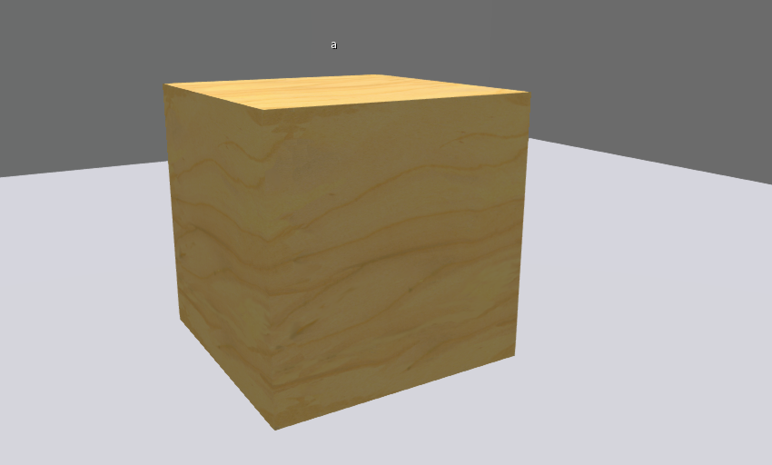 | 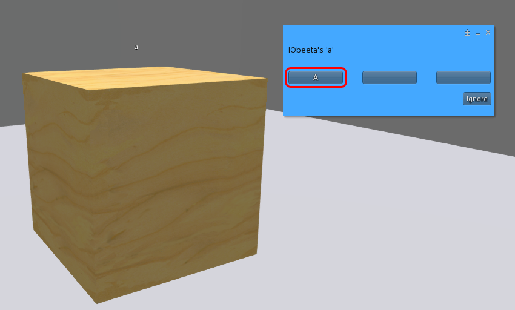 |
| 1. A single prim named "a", touch it | 2. Select "A" |
| 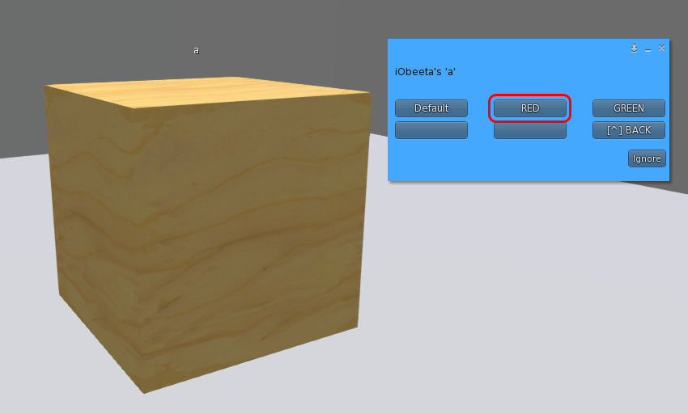 |  |
| 3. Select "RED" | 4. **RED** is applied to **all faces** of **a** |

### In linkset

Script in root prim, manage multiple faces of multiple prims.

```lsl
PART A|a|ALL_SIDES
SET Default|TEXTURE_PLYWOOD||
SET RED|9c198f45-3f70-1a50-f38c-8ce19044b396||
SET GREEN|2f8ae0e4-22be-20c8-c0cc-c50bbfaf2871||

PART B|b|3
SET Default|TEXTURE_PLYWOOD||
SET RED|9c198f45-3f70-1a50-f38c-8ce19044b396||
SET GREEN|2f8ae0e4-22be-20c8-c0cc-c50bbfaf2871||
```

```PART B|b|3``` Controls the 3rd face of the prim named "b"

|||
|---|---|
| 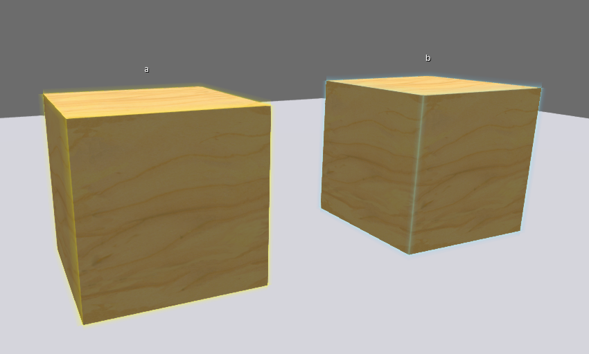 |  |
| 1. Linkset contains "a" and "b", the script is in the main prim, touch| 2. Select "B" |
|  |  |
| 3. Select "RED" | 4. **RED** is applied to **the 3rd face** of **b** |

### Subprim with the same name

The configuration is the same as the above example, we create another box, the name is also "b", and connect it. Do the same.

|||
|---|---|
| 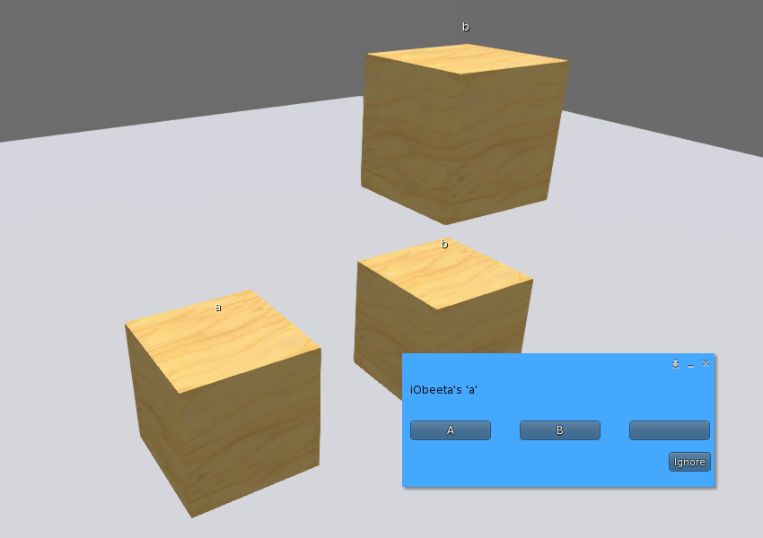 | 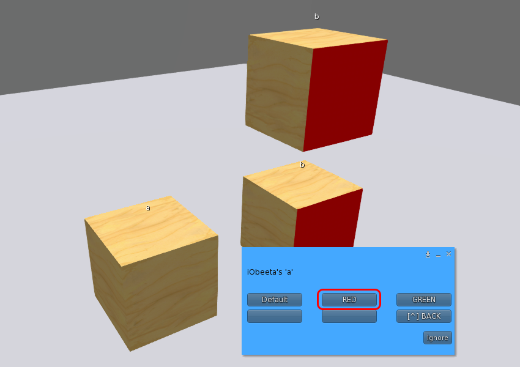 |
| 1. Linkset contains "a" and double "b" | 2. The same operation, **RED** is applied to **the 3rd face** of **all b** |

### Script in subprim

Script in subprim, at the same time, the root prim also has a popup menu.

A linkset containing "a" and "b", "a" is the root prim, let's put all the scripts into the subprim "b".

|||
|---|---|
| 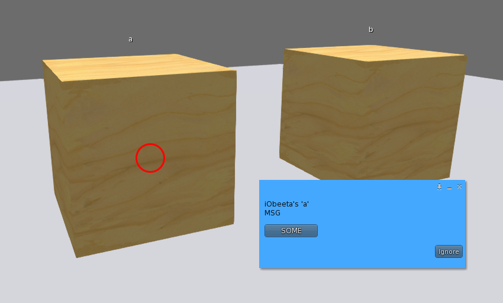 | 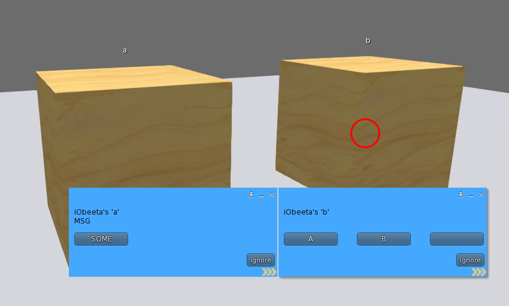 |
| 1. Touch "a" | 2. Touch "b", pop up two menus |

At this point if you use PASS_TOUCHS.

```lsl
PASS_TOUCHS 2

PART A|a|ALL_SIDES
SET Default|TEXTURE_PLYWOOD||
SET RED|9c198f45-3f70-1a50-f38c-8ce19044b396||
SET GREEN|2f8ae0e4-22be-20c8-c0cc-c50bbfaf2871||

PART B|b|3
SET Default|TEXTURE_PLYWOOD||
SET RED|9c198f45-3f70-1a50-f38c-8ce19044b396||
SET GREEN|2f8ae0e4-22be-20c8-c0cc-c50bbfaf2871||
```

|||
|---|---|
| 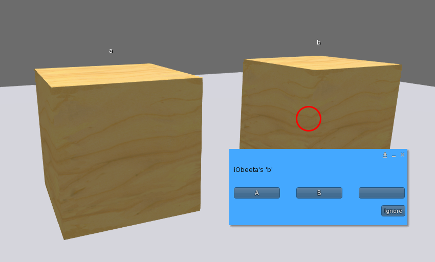 ||
| Touch "b", only pop up menus belonging to "b" ||

### How to use SETS

Set ```MENU_OPTION_SETS``` to enable.

In the code below, PART A includes Default, RED, GREEN, and PART B includes Default, RED, BLUE, and the SETS will automatically generate: Default, RED, GREEN, BLUE

Select one of them will take effect on the PART they are associated with.

- Default, RED is valid for **all faces** named **a** and **the 3rd face named b**
- GREEN is only valid for **all sides of a**
- BLUE is only valid for the **3rd face of b**

```lsl
MENU_OPTION_SETS [THEMES]

PART A|a|ALL_SIDES
SET Default|TEXTURE_PLYWOOD||
SET RED|9c198f45-3f70-1a50-f38c-8ce19044b396||
SET GREEN|2f8ae0e4-22be-20c8-c0cc-c50bbfaf2871||

PART B|b|3
SET Default|TEXTURE_PLYWOOD||
SET RED|9c198f45-3f70-1a50-f38c-8ce19044b396||
SET BLUE|2ddd156d-8107-6761-9b54-7165ec249704||
```

|||
|---|---|
| 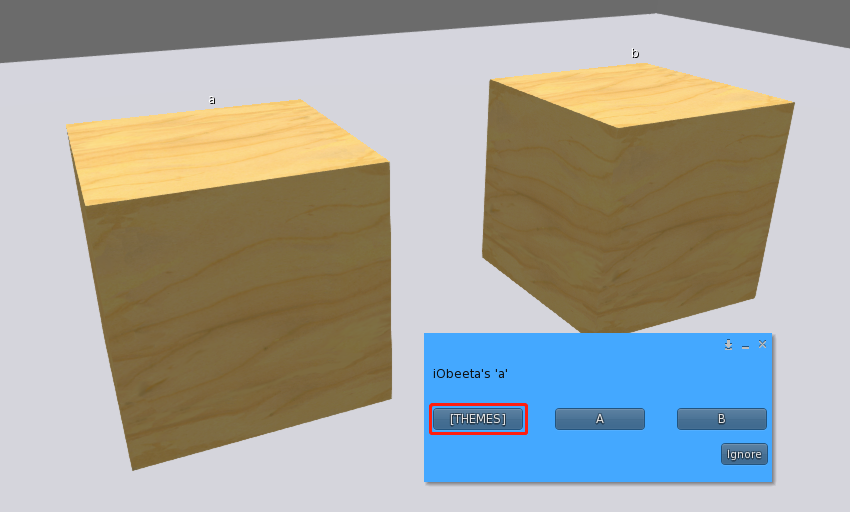 | 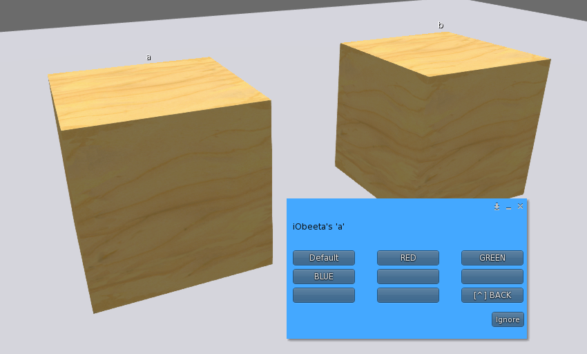 |
| 1. Touch "a" | 2. Select "\[THEMES\]", you will get the list, it is automatically generated |
| 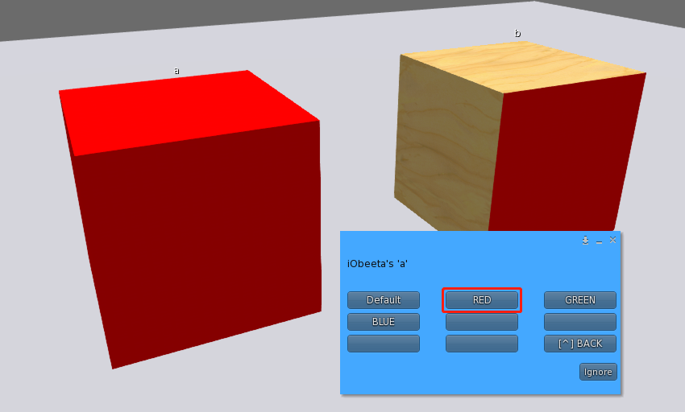 | 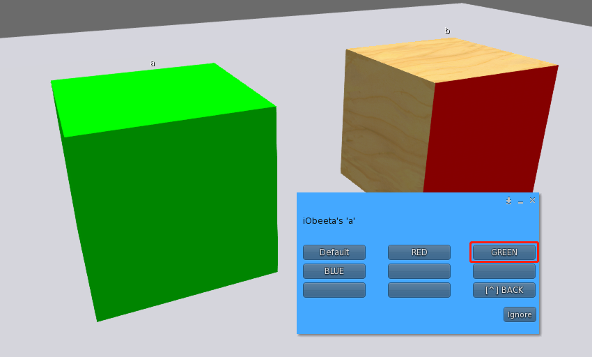 |
| Select "RED" | Select "GREEN" |
| 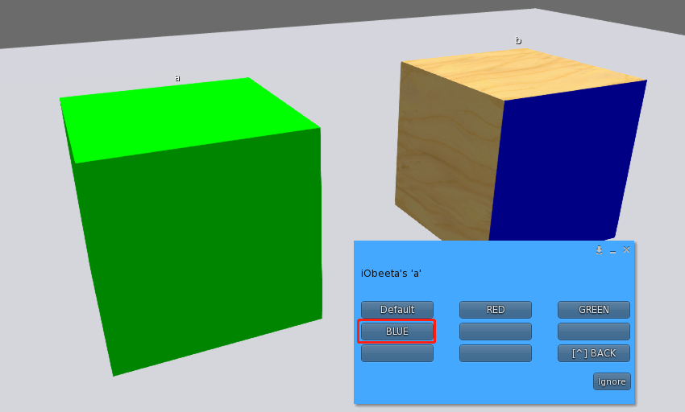 | 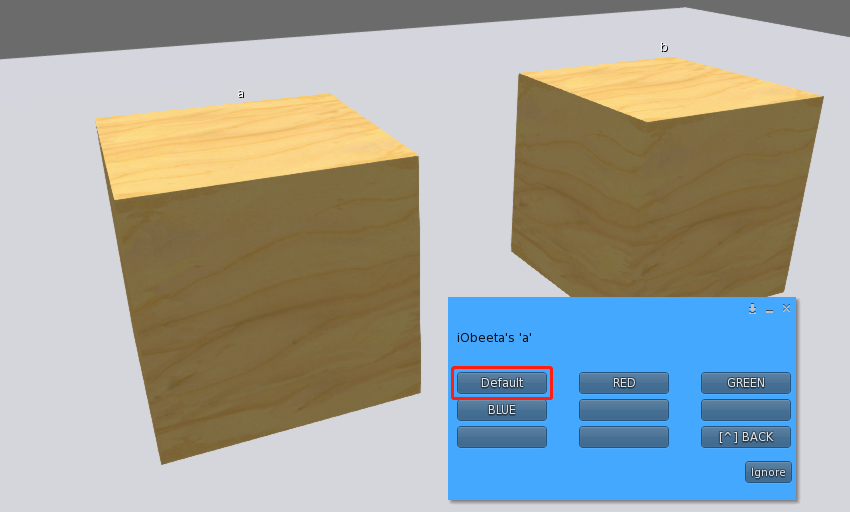 |
| Select "BLUE" | Select "Default" |

### Customize sets

You will use the configuration item ```SETS```

In the following code, the SETS menu only includes two options: RED and BLUE.

If you want to use Default and RED, you need to enter PART.

```lsl
MENU_OPTION_SETS [THEMES]
SETS RED|BLUE

PART A|a|ALL_SIDES
SET Default|TEXTURE_PLYWOOD||
SET RED|9c198f45-3f70-1a50-f38c-8ce19044b396||
SET GREEN|2f8ae0e4-22be-20c8-c0cc-c50bbfaf2871||

PART B|b|3
SET Default|TEXTURE_PLYWOOD||
SET RED|9c198f45-3f70-1a50-f38c-8ce19044b396||
SET BLUE|2ddd156d-8107-6761-9b54-7165ec249704||
```

|||
|---|---|
| 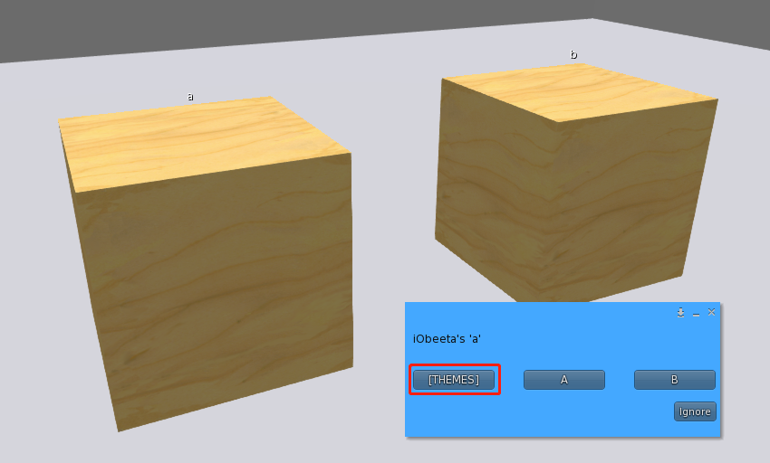 | 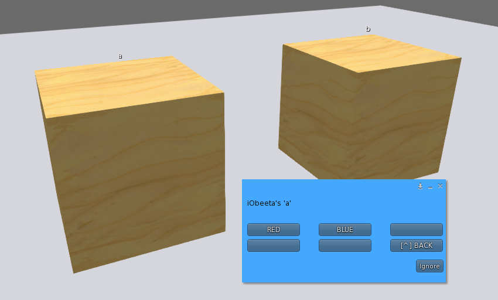 |
| 1. Touch "a" | 2. Select "\[THEMES\]", you will get the list |

## Configure

### LOG_LEVEL

log output level

- type: integer
- value:
  - 0: slient
  - 15: info
  - 31: debug
  - 63: trace/all
- default: 0

```lsl
LOG_LEVEL 0
```

### MENU_TEXT_PARTS

Hint text of menu PART

- type: string
- default: Empty string

```lsl
MENU_TEXT_PARTS PART:
```

### MENU_TEXT_SETS

Hint text of menu SET

- type: string
- default: Empty string

```lsl
MENU_TEXT_SETS SET:
```

### TOUCH

Is it possible to touch on an prim(subprim) to pop up the menu.

- type: integer
- value:
  - 0: no
  - 1: yes
- default: 1

```lsl
TOUCH 1
```

### PASS_TOUCHS

Sets the pass-touches prim attribute. Multiple menus pop up when you click on the subprim, this is useful.

Please refer to: [https://wiki.secondlife.com/wiki/LlPassTouches](https://wiki.secondlife.com/wiki/LlPassTouches)

- type: integer
- value:
  - 0: Touches are passed if there is no script handling the event in the prim.
  - 1: Touches are always passed to the root.
  - 2: Touches are never passed to the root.
- default: 0

```lsl
PASS_TOUCHS 0
```

### OWNER_ONLY

Only the owner can touch

- type: integer
- value:
  - 0: no
  - 1: yes
- default: 1

```lsl
OWNER_ONLY 1
```

### REMEMBER_MENU_STATS

Memorize the status of the menus that have been accessed. The next touch will open the last menu.

- type: integer
- value:
  - 0: no
  - 1: yes
- default: 0

```lsl
REMEMBER_MENU_STATS 0
```

### CHANNEL_LOCAL_MENU

Number in the link message to pop up the menu.

- type: integer
- value:
  - 0: disabled
  - except 0: enable
- default: 0

```lsl
CHANNEL_LOCAL_MENU 0
```

### CHANNEL_LOCAL_MENU_BACK

Number in the link message to returns to the previous menu.

When this configuration is enabled, it will be displayed as "[^] BACK" as an option in the PART menu

- type: integer
- value:
  - 0: disabled
  - except 0: enable
- default: 0

```lsl
CHANNEL_LOCAL_MENU_BACK 0
```

### CHANNEL_LOCAL_SYNC

Number in the link message to apply SETS.

It is used to receive broadcast data of CHANNEL_LOCAL_BOARDCAST

**Notice! CHANNEL_LOCAL_SYNC and CHANNEL_LOCAL_BOARDCAST cannot form a closed loop!**

- type: integer
- value:
  - 0: disabled
  - except 0: enable
- default: 0

```lsl
CHANNEL_LOCAL_SYNC 0
```

### CHANNEL_LOCAL_BOARDCAST

When SETS is applied, the data will be broadcast and received by CHANNEL_LOCAL_SYNC of the same value

**Notice! CHANNEL_LOCAL_SYNC and CHANNEL_LOCAL_BOARDCAST cannot form a closed loop!**

- type: integer
- value:
  - 0: disabled
  - except 0: enable
- default: 0

```lsl
CHANNEL_LOCAL_BOARDCAST 0
```

### MENU_OPTION_SETS

SETS option name

When this configuration is enabled, it will be available as an option in the PART menu.

- type: string
- default: Empty string

```lsl
MENU_OPTION_SETS [set name]
```

### SETS

Custom set list

Show list after entering from MENU_OPTION_SETS

If not set or given an empty string, a list will be automatically generated including all SET keywords in all PART.

- type: string
- default: Empty string

```lsl
SETS RED|GREEN
```

### PART

It can represent one or more prims, they use the same texture.

- param 1:
  - type: string
  - value: The name of PART
- param 2:
  - type: string
  - value: The name of prim/subprims
- param 3:
  - type: integer
  - value: 0 ~ 7 and -1(ALL_SIDES)

```lsl
PART OBJ_1|object name 1|ALL_SIDES
```

### PART*

Same as PART, but it doesn't show in the menu.

```lsl
PART* OBJ_2|object name 2|ALL_SIDES
SET RED|TEXTURE_BLANK|NULL_KEY|NULL_KEY
SET GREEN|TEXTURE_BLANK|NULL_KEY|NULL_KEY
```

### SET

It represents a theme or style.

Support constant input: TEXTURE_BLANK, TEXTURE_DEFAULT, TEXTURE_TRANSPARENT, TEXTURE_PLYWOOD, NULL_KEY.

Of course, you can also use their corresponding UUID directly.

See details: [https://wiki.secondlife.com/wiki/Category:LSL_Constants](https://wiki.secondlife.com/wiki/Category:LSL_Constants)

SET must follow PART, it cannot exist in isolation.

- param 1:
  - type: string
  - value: The name of SET
- param 2:
  - type: string
  - value: UUID / NULL_KEY / Empty string
- param 3:
  - type: string
  - value: UUID / NULL_KEY / Empty string
- param 3:
  - type: string
  - value: UUID / NULL_KEY / Empty string

**NULL_KEY will be set to initial (invalidate), Empty string will ignore this part (the original will remain unchanged)**

```lsl
SET RED|TEXTURE_BLANK|NULL_KEY|NULL_KEY
SET GREEN|TEXTURE_BLANK||
```

### BUTTON

Custom menu button.

It will be displayed on the same menu level as PART, click to send a link message.

The third parameter can be separated by "\|".

- param 1:
  - type: string
  - value: The name of button
- param 2:
  - type: integer
  - value: except 0
- param 3 and more: not required
  - type: string

```lsl
BUTTON MORE|100|arg1|arg2|arg3|...
BUTTON MORE|100|
```
